# Architecture Refactor Specification v2.0

## Lead Enterprise Solutions Architect — Technical Specification

> **Scope:** 4 Architectural Changes across `pi_youtube_stack`, `pi_tiktok_stack`, `pi_instagram_stack`, `pi_x_stack`
>
> **Date:** 2025
>
> **Status:** Implementation Spec

---

## Table of Contents

1. [Executive Summary](#1-executive-summary)
2. [Change 1 — Strict Human-in-the-Loop Approval Gates](#2-change-1--strict-human-in-the-loop-approval-gates)
3. [Change 2 — Redis Rate Limiter ("The Bouncer")](#3-change-2--redis-rate-limiter-the-bouncer)
4. [Change 3 — budgets.json Injection from Nextcloud](#4-change-3--budgetsjson-injection-from-nextcloud)
5. [Change 4 — Isolated Per-Platform Planner Agents](#5-change-4--isolated-per-platform-planner-agents)
6. [Pipeline Diagrams (Mermaid)](#6-pipeline-diagrams-mermaid)
7. [n8n Thumbnail Upload Webhook Payload](#7-n8n-thumbnail-upload-webhook-payload)
8. [File Change Manifest](#8-file-change-manifest)
9. [Port & Service Registry](#9-port--service-registry)

---

## 1. Executive Summary

### Current State

- **YouTube pipeline:** 6 steps (Fetch → Script → Validate → Metadata → Voiceover → RAG) with 2 Mattermost approval gates (script + audio)
- **TikTok/Instagram/X pipelines:** 8 steps (Scrape → Script → Validate → Voiceover → Footage → Assemble → Publish → RAG) with 1 Mattermost approval gate (final video approval in Step 7)
- **No planner agents** exist
- **No Redis** infrastructure exists
- **No budgets.json** exists
- **No rate limiting** on paid API calls

### Target State

- **Every pipeline phase** gated by Mattermost ✅/❌ approval buttons → n8n Wait node
- **Redis Bouncer** enforces per-platform weekly API budgets with 7-day TTL
- **budgets.json** on Nextcloud defines weekly quotas (YouTube=2000, TikTok=1000, Instagram=1000, X=1000 units)
- **4 isolated Planner Agents** (one per platform) read shared RAWG PostgreSQL cache
- **Skill_Thumbnail_Generator dropped** — final Publish gate accepts manual thumbnail upload via Mattermost → n8n webhook
- **No thumbnail auto-generation** — human uploads thumbnail image at final approval

### Architectural Principles

1. **Every gate pauses the n8n workflow** until human clicks Approve or Reject in Mattermost
2. **Redis is the single enforcement point** — no API call bypasses The Bouncer
3. **Budget is read-once-per-run** from Nextcloud WebDAV, cached in Redis for the week
4. **Planners are isolated** — each platform has its own planner with its own RAG context, but all read the shared RAWG game cache

---

## 2. Change 1 — Strict Human-in-the-Loop Approval Gates

### 2.1 YouTube Pipeline — New Gate Sequence

| Phase                | Script                      | Gate                       | Mattermost Message                                  | n8n Webhook                                     |
| -------------------- | --------------------------- | -------------------------- | --------------------------------------------------- | ----------------------------------------------- |
| **0. Plan**          | `planner_agent.py` (NEW)    | Gate 0                     | Plan summary + proposed content type + game list    | `/webhook/yt-approve-plan`                      |
| **1. Fetch Data**    | `fetch_game_data.py`        | Gate 1                     | Game count + titles + RAWG data summary             | `/webhook/yt-approve-data`                      |
| **2. Write Script**  | `generate_script.py`        | Gate 2                     | Full Arabic script + word count + duration estimate | `/webhook/yt-approve-script`                    |
| **3. Validate**      | `validate_script.py`        | _(auto-runs after Gate 2)_ | Validation score posted as notification only        | _(no separate gate — feeds into Gate 2 output)_ |
| **4. Metadata**      | `generate_metadata.py`      | Gate 3                     | Titles, description, tags, hashtags                 | `/webhook/yt-approve-metadata`                  |
| **5. Voiceover**     | `generate_voiceover.py`     | Gate 4                     | Audio file attached + duration                      | `/webhook/yt-approve-audio`                     |
| **6. Final Publish** | _(manual thumbnail upload)_ | Gate 5                     | Upload thumbnail prompt + publish confirmation      | `/webhook/yt-approve-publish`                   |
| **7. Update RAG**    | `update_rag.py`             | _(auto)_                   | Completion notification                             | _(no gate)_                                     |

**Key changes:**

- Validate (step 3) is merged into Script Write → its output enriches the Gate 2 message
- Gate 5 (Final Publish) includes a **file upload slot** for manual thumbnail — the n8n webhook accepts `multipart/form-data` with `thumbnail` field
- Gate 3 (Metadata) is NEW — user reviews SEO metadata before voiceover generation

### 2.2 TikTok/Instagram/X Pipeline — New Gate Sequence

| Phase                | Script                                                  | Gate     | Mattermost Message                               | n8n Webhook                           |
| -------------------- | ------------------------------------------------------- | -------- | ------------------------------------------------ | ------------------------------------- |
| **0. Plan**          | `planner_agent.py` (NEW)                                | Gate 0   | Plan summary + trending topics + proposed angle  | `/webhook/{platform}-approve-plan`    |
| **1. Scrape/Fetch**  | `step1_scrape_news.py`                                  | Gate 1   | Article count + top headlines + source breakdown | `/webhook/{platform}-approve-data`    |
| **2. Write Script**  | `step2_generate_script.py` + `step3_validate_script.py` | Gate 2   | Full script + validation score + news sources    | `/webhook/{platform}-approve-script`  |
| **3. Voiceover**     | `step4_generate_voiceover.py`                           | Gate 3   | Audio file attached + duration + word timestamps | `/webhook/{platform}-approve-audio`   |
| **4. Video Render**  | `step5_download_footage.py` + `step6_assemble_video.py` | Gate 4   | Rendered video attached + duration + file size   | `/webhook/{platform}-approve-video`   |
| **5. Final Publish** | `step7_publish_{platform}.py`                           | Gate 5   | Upload thumbnail prompt + caption preview        | `/webhook/{platform}-approve-publish` |
| **6. Update RAG**    | `step8_update_rag.py`                                   | _(auto)_ | Completion notification                          | _(no gate)_                           |

Where `{platform}` = `tiktok` | `instagram` | `x`

### 2.3 Mattermost Approval Message Contract

Every gate sends a structured Mattermost message with:

```python
props = {
    "attachments": [{
        "color": "#2196F3",  # Blue for pending
        "text": "",
        "actions": [
            {
                "id": f"approve_{gate_name}",
                "name": "✅ Approve",
                "integration": {
                    "url": f"{n8n_base_url}/webhook/{platform}-approve-{gate_name}",
                    "context": {
                        "action": "approve",
                        "pipeline_run_id": run_id,
                        "gate": gate_name,
                        "platform": platform,
                    }
                }
            },
            {
                "id": f"reject_{gate_name}",
                "name": "❌ Reject",
                "style": "danger",
                "integration": {
                    "url": f"{n8n_base_url}/webhook/{platform}-reject-{gate_name}",
                    "context": {
                        "action": "reject",
                        "pipeline_run_id": run_id,
                        "gate": gate_name,
                    }
                }
            }
        ]
    }]
}
```

### 2.4 n8n Wait Node Pattern

Each gate in n8n uses this pattern:

```
[Execute Phase N] → [Parse Output] → [Send Mattermost Approval] → [Approve Webhook (Wait)] → [Check Action]
                                                                                                    ├── approve → [Execute Phase N+1]
                                                                                                    └── reject  → [Store Rejection + Notify]
```

The Approve Webhook node acts as a **Wait node** — the workflow execution pauses until the human clicks Approve or Reject in Mattermost, which triggers the webhook callback.

---

## 3. Change 2 — Redis Rate Limiter ("The Bouncer")

### 3.1 Architecture

```
Pipeline Step → redis_rate_limiter.check_budget() → Redis
                      ↓ allowed?
               YES → Make API call (Gemini/ElevenLabs)
               NO  → Raise BudgetExhaustedError → Notify Mattermost → Halt pipeline
```

### 3.2 Redis Key Schema

```
budget:{platform}:{api_name}:week:{iso_week}
```

Examples:

- `budget:youtube:gemini:week:2025-W28`
- `budget:tiktok:elevenlabs:week:2025-W28`
- `budget:instagram:gemini:week:2025-W28`

**TTL:** 7 days (604800 seconds) — set on first increment, auto-expires

### 3.3 Unit Costs

| API Call                            | Units |
| ----------------------------------- | ----- |
| Gemini — Script generation          | 50    |
| Gemini — Script validation          | 30    |
| Gemini — Metadata generation        | 20    |
| Gemini — Clip planning              | 15    |
| Gemini — Planner Agent              | 25    |
| Gemini — Embedding (per batch)      | 5     |
| ElevenLabs — Voiceover (per minute) | 100   |
| RAWG API — Game fetch               | 2     |
| SerpAPI — News search               | 10    |

### 3.4 Service Implementation

**New file:** `services/redis_rate_limiter.py` (shared across all 4 content stacks)

```python
class RedisRateLimiter:
    """The Bouncer — enforces per-platform weekly API budgets via Redis."""

    def __init__(self, platform: str, redis_url: str = "redis://localhost:6379"):
        self.platform = platform  # "youtube" | "tiktok" | "instagram" | "x"
        self.redis = redis.Redis.from_url(redis_url, decode_responses=True)
        self._budget_limit = None  # Loaded from budgets.json

    def set_budget_limit(self, weekly_units: int):
        """Set the weekly budget for this platform (from budgets.json)."""
        self._budget_limit = weekly_units

    def check_and_consume(self, api_name: str, units: int) -> bool:
        """
        Check if budget allows `units` consumption.
        If yes, atomically increment and return True.
        If no, return False (caller must halt).
        """
        key = f"budget:{self.platform}:{api_name}:week:{self._current_week()}"
        current = int(self.redis.get(key) or 0)

        if self._budget_limit and (current + units) > self._budget_limit:
            return False

        pipe = self.redis.pipeline()
        pipe.incrby(key, units)
        pipe.expire(key, 604800)  # 7-day TTL
        pipe.execute()
        return True

    def get_remaining(self, api_name: str) -> int:
        """Get remaining budget units for this week."""
        key = f"budget:{self.platform}:{api_name}:week:{self._current_week()}"
        used = int(self.redis.get(key) or 0)
        return max(0, (self._budget_limit or 0) - used)

    def get_usage_report(self) -> dict:
        """Get full usage report for all APIs this week."""
        ...

    @staticmethod
    def _current_week() -> str:
        from datetime import date
        return date.today().isocalendar()[1]  # Returns "2025-W28" format
```

### 3.5 Integration Points

Every paid API call wraps through The Bouncer:

```python
# In gemini_service.py — before every API call:
bouncer = RedisRateLimiter(platform="youtube")
if not bouncer.check_and_consume("gemini", units=50):
    raise BudgetExhaustedError("YouTube Gemini budget exhausted for this week")
# ... proceed with Gemini API call

# In elevenlabs_service.py — before every API call:
bouncer = RedisRateLimiter(platform="youtube")
duration_minutes = estimated_duration / 60
units = int(duration_minutes * 100)
if not bouncer.check_and_consume("elevenlabs", units=units):
    raise BudgetExhaustedError("YouTube ElevenLabs budget exhausted for this week")
# ... proceed with ElevenLabs API call
```

### 3.6 Docker Infrastructure

Add Redis container to each content stack's `docker-compose.yml`:

```yaml
  redis_{platform}:
    image: redis:7-alpine
    container_name: redis_{platform}
    restart: unless-stopped
    command: redis-server --maxmemory 64mb --maxmemory-policy allkeys-lru
    ports:
      - "{port}:6379"
    volumes:
      - redis_{platform}_data:/data
    healthcheck:
      test: ["CMD", "redis-cli", "ping"]
      interval: 10s
      timeout: 5s
      retries: 3
    networks:
      - {platform}_stack_net
    deploy:
      resources:
        limits:
          memory: 128M
```

Port allocation:
| Platform | Redis Port |
|----------|-----------|
| YouTube | 6379 |
| TikTok | 6380 |
| Instagram | 6381 |
| X | 6382 |

---

## 4. Change 3 — budgets.json Injection from Nextcloud

### 4.1 File Location

```
Nextcloud WebDAV: https://192.168.1.100:8443/remote.php/dav/files/{user}/pi_config/budgets.json
Local fallback: /home/node/project/config/budgets.json
```

### 4.2 budgets.json Schema

```json
{
  "version": 1,
  "total_weekly_units": 5000,
  "platforms": {
    "youtube": {
      "weekly_units": 2000,
      "priority": 1,
      "enabled": true
    },
    "tiktok": {
      "weekly_units": 1000,
      "priority": 2,
      "enabled": true
    },
    "instagram": {
      "weekly_units": 1000,
      "priority": 3,
      "enabled": true
    },
    "x": {
      "weekly_units": 1000,
      "priority": 4,
      "enabled": true
    }
  },
  "api_costs": {
    "gemini_script": 50,
    "gemini_validate": 30,
    "gemini_metadata": 20,
    "gemini_clip_plan": 15,
    "gemini_planner": 25,
    "gemini_embedding": 5,
    "elevenlabs_per_minute": 100,
    "rawg_fetch": 2,
    "serpapi_search": 10
  },
  "alerts": {
    "warn_at_percent": 80,
    "critical_at_percent": 95
  }
}
```

### 4.3 Budget Reader Service

**New file:** `services/budget_reader.py` (shared across all 4 content stacks)

```python
class BudgetReader:
    """Reads budgets.json from Nextcloud WebDAV with local fallback."""

    NEXTCLOUD_URL = "https://192.168.1.100:8443/remote.php/dav/files"
    CACHE_TTL = 3600  # Re-read from Nextcloud at most once per hour

    def __init__(self, platform: str, redis_client=None):
        self.platform = platform
        self.redis = redis_client
        self._cache_key = "budgets:config:json"

    def load(self) -> dict:
        """
        Load budgets.json — tries Redis cache → Nextcloud WebDAV → local file.
        Returns the platform-specific budget config.
        """
        ...

    def get_weekly_budget(self) -> int:
        """Get this platform's weekly budget in units."""
        config = self.load()
        return config["platforms"][self.platform]["weekly_units"]

    def get_api_cost(self, api_name: str) -> int:
        """Get the unit cost for a specific API call."""
        config = self.load()
        return config["api_costs"].get(api_name, 1)
```

### 4.4 Integration Flow

At the **start of every pipeline run** (in the Planner Agent or first pipeline step):

```python
# 1. Read budgets.json
reader = BudgetReader(platform="youtube")
budget = reader.get_weekly_budget()  # → 2000

# 2. Configure The Bouncer
bouncer = RedisRateLimiter(platform="youtube")
bouncer.set_budget_limit(budget)

# 3. Report budget status to Mattermost
remaining = bouncer.get_remaining("all")
mm.send_status(f"📊 Budget: {remaining}/{budget} units remaining this week")
```

---

## 5. Change 4 — Isolated Per-Platform Planner Agents

### 5.1 Architecture

Each content stack gets its own `agents/planner_agent.py` that:

1. Reads the **shared RAWG PostgreSQL cache** (YouTube's database at port 5433)
2. Reads its own **platform-specific RAG context** (local database)
3. Checks **Redis budget** remaining for the week
4. Generates a **content plan** tailored to the platform format
5. Sends the plan to Mattermost for **Gate 0 approval**

### 5.2 Shared RAWG Database Access

All planners connect to YouTube's PostgreSQL (port 5433) as a **read-only** data source:

```python
SHARED_RAWG_DB = {
    "host": "192.168.1.100",  # Pi's IP
    "port": 5433,
    "name": "youtube_rag",
    "user": "yt_readonly",     # New read-only user
    "password": "...",
}
```

**New SQL (add to YouTube's `database/init.sql`):**

```sql
-- Read-only user for cross-stack RAWG access
CREATE USER yt_readonly WITH PASSWORD 'readonly_pass_2025';
GRANT CONNECT ON DATABASE youtube_rag TO yt_readonly;
GRANT USAGE ON SCHEMA public TO yt_readonly;
GRANT SELECT ON games TO yt_readonly;
```

### 5.3 Planner Agent Implementation

**New file:** `agents/planner_agent.py` (per stack)

```python
class PlannerAgent(BaseAgent):
    """
    Platform-specific content planner.
    Reads shared RAWG cache + local RAG to propose content ideas.
    """

    @property
    def agent_name(self) -> str:
        return f"Planner Agent ({self.platform})"

    def __init__(self, platform: str):
        super().__init__()
        self.platform = platform
        self.rawg_db = self._connect_shared_rawg()
        self.bouncer = RedisRateLimiter(platform=platform)

    def execute(self, **kwargs) -> dict:
        """
        Generate a content plan:
        1. Query trending/new games from shared RAWG cache
        2. Check what's already been covered (RAG)
        3. Check remaining budget
        4. Propose content angle tailored to platform
        """
        trending_games = self._get_trending_games()
        covered_topics = self._get_covered_topics()
        remaining_budget = self.bouncer.get_remaining("all")

        plan = self.gemini.generate(
            system_prompt=PLANNER_SYSTEM_PROMPT,
            user_prompt=get_planner_prompt(
                platform=self.platform,
                trending_games=trending_games,
                covered_topics=covered_topics,
                remaining_budget=remaining_budget,
            ),
        )

        return {
            "plan_id": str(uuid.uuid4()),
            "platform": self.platform,
            "proposed_content_type": plan.content_type,
            "proposed_topic": plan.topic,
            "proposed_angle": plan.angle,
            "game_slugs": plan.game_slugs,
            "estimated_cost": plan.estimated_units,
            "budget_remaining": remaining_budget,
        }
```

### 5.4 Platform Specializations

| Platform      | Planner Focus                                     | Content Format     | Duration Target |
| ------------- | ------------------------------------------------- | ------------------ | --------------- |
| **YouTube**   | Monthly releases, AAA reviews, upcoming games     | Long-form 10-15min | 10-15 minutes   |
| **TikTok**    | Trending news hooks, viral moments, hot takes     | Short-form 30-60s  | 30-60 seconds   |
| **Instagram** | Visual game highlights, aesthetic content         | Reels 30-60s       | 30-60 seconds   |
| **X**         | Breaking news, controversial takes, quick updates | Short-form 30-45s  | 30-45 seconds   |

---

## 6. Pipeline Diagrams (Mermaid)

### 6.1 YouTube Content Pipeline

```mermaid
flowchart TD
    START([🕐 Schedule / Manual Trigger]) --> BUDGET[📊 Load budgets.json<br/>from Nextcloud]
    BUDGET --> PLAN[🧠 Planner Agent<br/>Query RAWG Cache + RAG]

    PLAN --> GATE0{🔔 Mattermost Gate 0<br/>Plan Review}
    GATE0 -- ✅ Approve --> FETCH[📥 Fetch Game Data<br/>RAWG API → PostgreSQL]
    GATE0 -- ❌ Reject --> REJECT0[📝 Store Rejection<br/>in RAG + Notify]

    FETCH --> GATE1{🔔 Mattermost Gate 1<br/>Data Review}
    GATE1 -- ✅ Approve --> SCRIPT[✍️ Writer Agent<br/>Gemini → Arabic Script]
    GATE1 -- ❌ Reject --> REJECT1[📝 Reject + Notify]

    SCRIPT --> VALIDATE[🔍 Validator Agent<br/>AI Quality Check]
    VALIDATE --> GATE2{🔔 Mattermost Gate 2<br/>Script + Validation Review}
    GATE2 -- ✅ Approve --> META[🏷️ Metadata Agent<br/>SEO Titles/Tags/Description]
    GATE2 -- ❌ Reject --> REJECT2[📝 Reject + Notify]

    META --> GATE3{🔔 Mattermost Gate 3<br/>Metadata Review}
    GATE3 -- ✅ Approve --> VOICE[🎙️ ElevenLabs TTS<br/>Arabic Voiceover]
    GATE3 -- ❌ Reject --> REJECT3[📝 Reject + Notify]

    VOICE --> GATE4{🔔 Mattermost Gate 4<br/>Audio Review}
    GATE4 -- ✅ Approve --> PUBLISH{🔔 Mattermost Gate 5<br/>Final Publish<br/>📎 Upload Thumbnail}
    GATE4 -- ❌ Reject --> REJECT4[📝 Reject + Re-generate]

    PUBLISH -- ✅ Approve + 🖼️ Thumbnail --> RAG[🧠 Update RAG<br/>+ Completion Notification]
    PUBLISH -- ❌ Reject --> REJECT5[📝 Reject + Notify]

    subgraph REDIS[🔴 Redis Bouncer]
        direction LR
        CHECK[Budget Check] --> ALLOW[✅ Allow]
        CHECK --> DENY[❌ Deny → Halt]
    end

    SCRIPT -.-> REDIS
    META -.-> REDIS
    VOICE -.-> REDIS
    PLAN -.-> REDIS

    style GATE0 fill:#2196F3,color:#fff
    style GATE1 fill:#2196F3,color:#fff
    style GATE2 fill:#2196F3,color:#fff
    style GATE3 fill:#2196F3,color:#fff
    style GATE4 fill:#2196F3,color:#fff
    style PUBLISH fill:#FF9800,color:#fff
    style REDIS fill:#f44336,color:#fff
```



### 6.2 TikTok Content Pipeline

```mermaid
flowchart TD
    START([🕐 Daily 9AM / Manual]) --> BUDGET[📊 Load budgets.json]
    BUDGET --> PLAN[🧠 TikTok Planner<br/>RAWG Cache + Trending News]

    PLAN --> GATE0{🔔 Gate 0<br/>Plan Review}
    GATE0 -- ✅ --> SCRAPE[📰 Scrape News<br/>RSS + Google + Reddit]
    GATE0 -- ❌ --> R0[Reject]

    SCRAPE --> GATE1{🔔 Gate 1<br/>Data Review}
    GATE1 -- ✅ --> SCRIPT[✍️ Writer Agent<br/>TikTok Script]
    GATE1 -- ❌ --> R1[Reject]

    SCRIPT --> VALIDATE[🔍 Validator Agent<br/>+ Auto-Revise]
    VALIDATE --> GATE2{🔔 Gate 2<br/>Script Review}
    GATE2 -- ✅ --> VOICE[🎙️ ElevenLabs TTS<br/>+ Timestamps]
    GATE2 -- ❌ --> R2[Reject]

    VOICE --> GATE3{🔔 Gate 3<br/>Audio Review}
    GATE3 -- ✅ --> FOOTAGE[📹 Download Footage<br/>yt-dlp + ClipAgent]
    GATE3 -- ❌ --> R3[Reject]

    FOOTAGE --> ASSEMBLE[🎬 Assemble Video<br/>FFmpeg 9:16]
    ASSEMBLE --> GATE4{🔔 Gate 4<br/>Video Review}
    GATE4 -- ✅ --> PUBLISH{🔔 Gate 5<br/>Final Publish<br/>📎 Upload Thumbnail}
    GATE4 -- ❌ --> R4[Reject]

    PUBLISH -- ✅ + 🖼️ --> BUFFER[📤 Buffer API<br/>→ TikTok]
    BUFFER --> RAG[🧠 Update RAG]
    PUBLISH -- ❌ --> R5[Reject]

    SCRIPT -.-> REDIS[🔴 Redis Bouncer]
    VOICE -.-> REDIS
    FOOTAGE -.-> REDIS
    PLAN -.-> REDIS

    style GATE0 fill:#2196F3,color:#fff
    style GATE1 fill:#2196F3,color:#fff
    style GATE2 fill:#2196F3,color:#fff
    style GATE3 fill:#2196F3,color:#fff
    style GATE4 fill:#2196F3,color:#fff
    style PUBLISH fill:#FF9800,color:#fff
    style REDIS fill:#f44336,color:#fff
```



### 6.3 Instagram Reels Pipeline


### 6.4 X/Twitter Pipeline


---

## 7. n8n Thumbnail Upload Webhook Payload

### 7.1 Mattermost → n8n Flow

When the user reaches **Gate 5 (Final Publish)**, the Mattermost message includes:

1. A summary of the completed content
2. An "Upload Thumbnail" button that opens a Mattermost file upload dialog
3. An "Approve & Publish" button that triggers the n8n webhook

**The publish webhook accepts `multipart/form-data`** so the thumbnail can be uploaded directly.

### 7.2 n8n Webhook Node Configuration

```json
{
  "parameters": {
    "httpMethod": "POST",
    "path": "{platform}-approve-publish",
    "responseMode": "responseNode",
    "options": {
      "rawBody": true
    }
  },
  "id": "{platform}-webhook-publish",
  "name": "Final Publish Webhook",
  "type": "n8n-nodes-base.webhook",
  "typeVersion": 2,
  "webhookId": "{platform}-approve-publish",
  "notes": "Receives final publish approval with optional thumbnail upload. Accepts multipart/form-data with 'thumbnail' file field."
}
```

### 7.3 Mattermost Integration Payload (Approve Button)

When the user clicks "✅ Approve & Publish" in Mattermost, the interactive message sends this payload to n8n:

```json
{
  "user_id": "mattermost_user_id",
  "channel_id": "pipeline-youtube-channel-id",
  "trigger_id": "unique_trigger_id",
  "post_id": "original_post_id",
  "context": {
    "action": "approve",
    "pipeline_run_id": "uuid-of-pipeline-run",
    "gate": "publish",
    "platform": "youtube",
    "video_id": "uuid-of-rendered-video",
    "script_id": "uuid-of-script"
  }
}
```

### 7.4 Manual Thumbnail Upload via Mattermost → n8n

Since Mattermost's interactive buttons cannot include file attachments, the thumbnail workflow works as follows:

**Step 1:** Bot posts the Gate 5 message with instructions:

```markdown
### 🎬 Ready to Publish — Monthly Game Releases

| Field        | Value       |
| :----------- | :---------- |
| **Platform** | YouTube     |
| **Duration** | 12:30       |
| **Script**   | ✅ Approved |
| **Audio**    | ✅ Approved |
| **Metadata** | ✅ Approved |

---

📎 **Thumbnail Upload:**
Reply to this message with your thumbnail image attached, then click Approve.
The bot will pick up the most recent image in this thread.

_If no thumbnail is uploaded, the video will be published without one._
```

**Step 2:** User replies to the message with an image file attached.

**Step 3:** User clicks "✅ Approve & Publish" button.

**Step 4:** The n8n webhook handler:

1. Receives the button callback with `post_id`
2. Uses Mattermost API to fetch the thread: `GET /api/v4/posts/{post_id}/thread`
3. Scans thread replies for file attachments of type `image/*`
4. Downloads the most recent image: `GET /api/v4/files/{file_id}`
5. Passes it as the thumbnail to the publish step

### 7.5 n8n Thumbnail Extraction Node (Code Node)

```json
{
  "parameters": {
    "jsCode": "// Extract thumbnail from Mattermost thread\nconst postId = $json.context.post_id || $json.post_id;\nconst mmUrl = $env.MATTERMOST_URL;\nconst botToken = $env.MATTERMOST_BOT_TOKEN;\n\n// 1. Fetch thread\nconst threadResp = await fetch(\n  `${mmUrl}/api/v4/posts/${postId}/thread`,\n  { headers: { 'Authorization': `Bearer ${botToken}` } }\n);\nconst thread = await threadResp.json();\n\n// 2. Find most recent image attachment\nlet thumbnailFileId = null;\nlet thumbnailFilename = null;\nconst postOrder = thread.order || [];\n\nfor (const pid of postOrder.reverse()) {\n  const post = thread.posts[pid];\n  if (post.file_ids && post.file_ids.length > 0) {\n    // Check each file for image type\n    for (const fid of post.file_ids) {\n      const infoResp = await fetch(\n        `${mmUrl}/api/v4/files/${fid}/info`,\n        { headers: { 'Authorization': `Bearer ${botToken}` } }\n      );\n      const info = await infoResp.json();\n      if (info.mime_type && info.mime_type.startsWith('image/')) {\n        thumbnailFileId = fid;\n        thumbnailFilename = info.name;\n        break;\n      }\n    }\n    if (thumbnailFileId) break;\n  }\n}\n\n// 3. Download thumbnail if found\nlet thumbnailBase64 = null;\nif (thumbnailFileId) {\n  const fileResp = await fetch(\n    `${mmUrl}/api/v4/files/${thumbnailFileId}`,\n    { headers: { 'Authorization': `Bearer ${botToken}` } }\n  );\n  const buffer = await fileResp.arrayBuffer();\n  thumbnailBase64 = Buffer.from(buffer).toString('base64');\n}\n\nreturn [{\n  json: {\n    ...$json,\n    thumbnail_found: !!thumbnailFileId,\n    thumbnail_file_id: thumbnailFileId,\n    thumbnail_filename: thumbnailFilename,\n    thumbnail_base64: thumbnailBase64\n  }\n}];"
  },
  "id": "{platform}-extract-thumbnail",
  "name": "Extract Thumbnail from Thread",
  "type": "n8n-nodes-base.code",
  "typeVersion": 2,
  "position": [0, 0],
  "notes": "Scans Mattermost thread for image attachments. Downloads the most recent one as base64 for publish step."
}
```

---

## 8. File Change Manifest

### 8.1 New Files to Create

| File                                | Stack | Purpose                                |
| ----------------------------------- | ----- | -------------------------------------- |
| `services/redis_rate_limiter.py`    | ALL 4 | Redis Bouncer — budget enforcement     |
| `services/budget_reader.py`         | ALL 4 | Read budgets.json from Nextcloud/local |
| `agents/planner_agent.py`           | ALL 4 | Platform-specific content planner      |
| `config/prompts/planner_prompts.py` | ALL 4 | Planner agent system/user prompts      |
| `config/budgets.json`               | ALL 4 | Local fallback budget config           |

### 8.2 Files to Modify

| File                                            | Stack                | Change                                                       |
| ----------------------------------------------- | -------------------- | ------------------------------------------------------------ |
| `services/mattermost_service.py`                | ALL 4                | Add `send_gate_approval()` universal gate method             |
| `services/gemini_service.py`                    | ALL 4                | Wrap API calls through Redis Bouncer                         |
| `services/elevenlabs_service.py`                | ALL 4                | Wrap API calls through Redis Bouncer                         |
| `config/settings.py`                            | ALL 4                | Add `RedisConfig`, `BudgetConfig`, `SharedRAWGConfig`        |
| `.env.example`                                  | ALL 4                | Add `REDIS_URL`, `NEXTCLOUD_BUDGETS_*`, `SHARED_RAWG_*` vars |
| `docker-compose.yml`                            | ALL 4 content stacks | Add Redis service                                            |
| `n8n_workflow.json` / `workflow.json`           | ALL 4                | Add approval webhook nodes between every phase               |
| YouTube `scripts/validate_script.py`            | YouTube              | Remove standalone Mattermost approval (merged into gate)     |
| YouTube `scripts/generate_voiceover.py`         | YouTube              | Remove standalone Mattermost approval (merged into gate)     |
| TikTok `pipeline/step7_publish_tiktok.py`       | TikTok               | Refactor to use gate pattern                                 |
| Instagram `pipeline/step7_publish_instagram.py` | Instagram            | Refactor to use gate pattern                                 |
| X `pipeline/step7_publish_x.py`                 | X                    | Refactor to use gate pattern                                 |
| YouTube `database/init.sql`                     | YouTube              | Add `yt_readonly` user for cross-stack RAWG access           |

### 8.3 Files to Delete

| File                                            | Reason                              |
| ----------------------------------------------- | ----------------------------------- |
| Any `*thumbnail_generator*` files               | Skill_Thumbnail_Generator dropped   |
| Old `slack_service.py` files (if still present) | Rollback insurance no longer needed |

---

## 9. Port & Service Registry

### Updated Port Allocation

| Port     | Service                            | Stack                          |
| -------- | ---------------------------------- | ------------------------------ |
| 53       | Pi-hole DNS                        | pi_hole_stack                  |
| 80       | Pi-hole Web                        | pi_hole_stack                  |
| 443      | Cloudflare Tunnel                  | pi_remote_access_stack         |
| 3001     | Uptime Kuma                        | pi_command_center              |
| 3010     | Grafana                            | pi_command_center              |
| 5433     | PostgreSQL (YouTube + shared RAWG) | pi_youtube_stack               |
| 5434     | PostgreSQL (TikTok)                | pi_tiktok_stack                |
| 5435     | PostgreSQL (Instagram)             | pi_instagram_stack             |
| 5436     | PostgreSQL (X)                     | pi_x_stack                     |
| 5437     | PostgreSQL (Mattermost)            | pi_mattermost_stack            |
| 5438     | PostgreSQL (Nextcloud)             | pi_nextcloud_stack             |
| 5678     | n8n (YouTube)                      | pi_youtube_stack               |
| 5679     | n8n (TikTok)                       | pi_tiktok_stack                |
| 5680     | n8n (Instagram)                    | pi_instagram_stack             |
| 5681     | n8n (X)                            | pi_x_stack                     |
| **6379** | **Redis (YouTube)**                | **pi_youtube_stack** _(NEW)_   |
| **6380** | **Redis (TikTok)**                 | **pi_tiktok_stack** _(NEW)_    |
| **6381** | **Redis (Instagram)**              | **pi_instagram_stack** _(NEW)_ |
| **6382** | **Redis (X)**                      | **pi_x_stack** _(NEW)_         |
| 8065     | Mattermost                         | pi_mattermost_stack            |
| 8080     | Nextcloud                          | pi_nextcloud_stack             |
| 8443     | Nextcloud HTTPS                    | pi_nextcloud_stack             |

### Mattermost Bot Registry

| Bot           | Token Env Var          | Channel             |
| ------------- | ---------------------- | ------------------- |
| bot-youtube   | `MATTERMOST_BOT_TOKEN` | #pipeline-youtube   |
| bot-tiktok    | `MATTERMOST_BOT_TOKEN` | #pipeline-tiktok    |
| bot-instagram | `MATTERMOST_BOT_TOKEN` | #pipeline-instagram |
| bot-x         | `MATTERMOST_BOT_TOKEN` | #pipeline-x         |

---

_End of specification._
