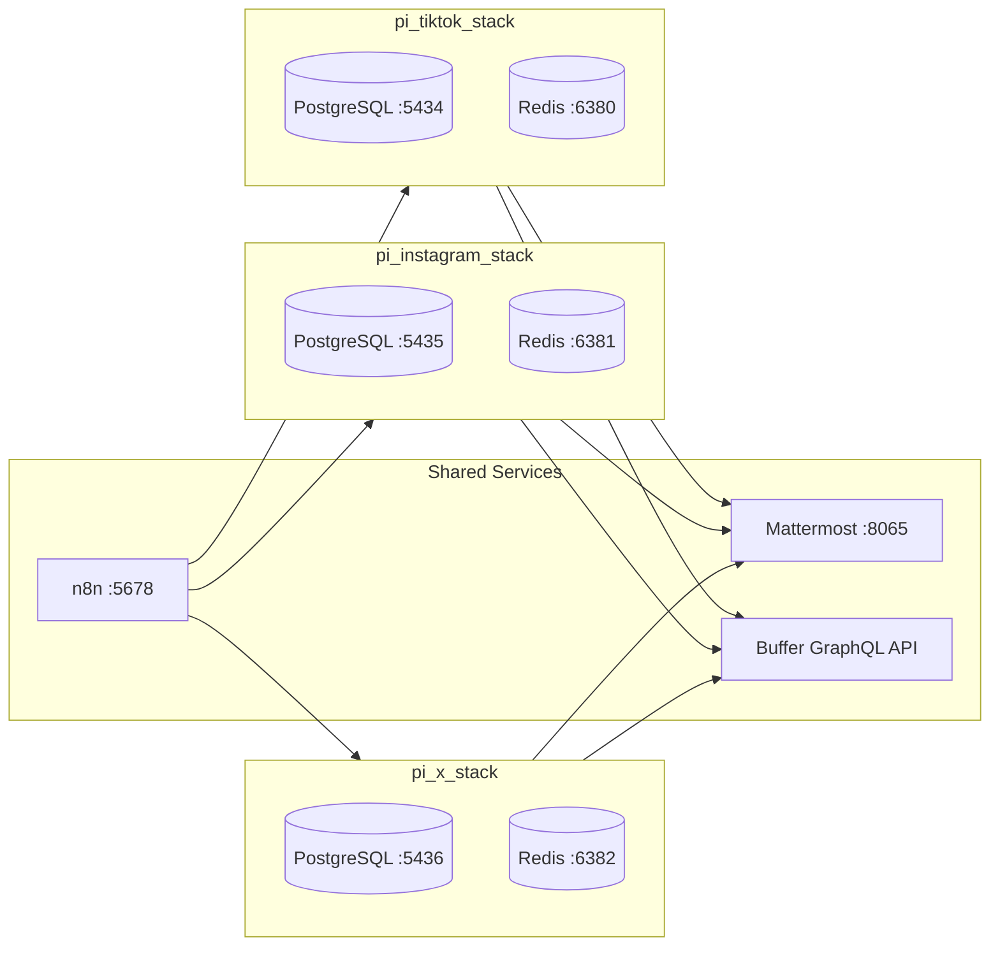

# pi_setup

Raspberry Pi 5 — stack index & operations cheatsheet.

**Tailscale IP:** `100.113.255.62`  
**LAN IP:** `192.168.0.11`

> Use the Tailscale IP from your phone/laptop. Use the LAN IP for container-to-container communication.

---

## Stacks

| Stack | Description | Deployed |
|-------|-------------|----------|
| `pi_hole_stack` | Pi-hole + Unbound — DNS / ad blocking | ✅ Yes |
| `pi_mattermost_stack` | Mattermost + PostgreSQL — approval hub | ✅ Yes |
| `pi_remote_access_stack` | Tailscale (host) + Cloudflared — remote access | ✅ Yes (Tailscale on host, not Docker) |
| `pi_n8n_stack` | n8n (shared instance) — workflow orchestration | ✅ Yes |
| `pi_tiktok_stack` | PostgreSQL + Redis — TikTok pipeline (5-gate HITL) | ✅ Yes |
| `pi_instagram_stack` | PostgreSQL + Redis — Instagram Reels pipeline (5-gate HITL) | ✅ Yes |
| `pi_x_stack` | PostgreSQL + Redis — X/Twitter pipeline (5-gate HITL) | ✅ Yes |
| `pi_command_center` | Homepage + Uptime Kuma — dashboard & alerts | ❌ No |
| `pi_nextcloud_stack` | Nextcloud + PostgreSQL + Redis + Caddy — cloud storage | ❌ No |
| `pi_youtube_stack` | n8n + PostgreSQL + Redis — YouTube pipeline (in progress) | ❌ No |

---

## Content Pipeline Architecture

All 3 content pipelines (TikTok, Instagram, X) share the same architecture:



### 5-Gate Human-in-the-Loop Flow (all platforms)

```
Gate 0: Plan → Gate 1: News → Gate 2: Script → Gate 3: Voiceover → Gate 4: Publish
```

Gate 4 (Publish) includes:
- SEO caption (Arabic + English) + hashtags + best post time
- Upload video + thumbnail as Mattermost reply
- Interactive scheduling dialog (date/time picker)
- Push to Buffer GraphQL API with schedule

### Buffer Channels

| Platform | Buffer Channel ID | Account |
|----------|------------------|---------|
| TikTok | `69a9d6033f3b94a1211ca539` | @tvv_arabic |
| Instagram | `67ab8b3acc7f0c250ca5f8ea` | @tvv_arabic |
| X/Twitter | `67ab8b48cc7f0c250ca6c853` | @TVV_Arabic |

Buffer API: `https://api.buffer.com/graphql` (v1 REST API is dead)

### Gemini Model Routing (all platforms)

| Task | Model |
|------|-------|
| Planner, Scraper, Validator | gemini-2.5-flash |
| Writer, SEO | gemini-3.1-pro-preview |

### n8n Workflows

| Workflow | ID | Trigger | Webhook |
|----------|----|---------|---------|
| TikTok Pipeline | `6DF7xGPRVtHh0knr` | Daily 10AM | `tiktok-manual` |
| Instagram Reels Pipeline | `sqViD3E6dz0znM8y` | — | `instagram-manual` |
| X/Twitter Pipeline | `CnwyI8DuWp33iveC` | Daily 2PM | `x-manual` |

### Mattermost Channels (5 per platform)

| Gate | TikTok | Instagram | X |
|------|--------|-----------|---|
| 0️⃣ Plan | #tiktok-plan | #instagram-plan | #x-plan |
| 1️⃣ News | #tiktok-news | #instagram-news | #x-news |
| 2️⃣ Script | #tiktok-script | #instagram-script | #x-script |
| 3️⃣ Voiceover | #tiktok-voiceover | #instagram-voiceover | #x-voiceover |
| 4️⃣ Publish | #tiktok-publish | #ig-publish-private | #x-publish |

---

## Web UIs (via Tailscale)

| Service | URL | Notes |
|---------|-----|-------|
| **n8n** | http://100.113.255.62:5678 | Workflow editor, executions, logs |
| **Mattermost** | http://100.113.255.62:8065 | Pipeline approval channels |
| **Pi-hole** | http://100.113.255.62:8080/admin | DNS dashboard |

---

## Running Containers

```bash
# List all running containers with ports and health
docker ps --format "table {{.Names}}\t{{.Status}}\t{{.Ports}}"

# View logs (last 50 lines, follow)
docker logs <name> --tail 50 -f

# Restart a stack
cd ~/pi_setup/<stack_folder> && docker compose restart

# Shell into a container
docker exec -it <name> sh
```

### Current Containers

| Container | Port | Stack | Purpose |
|-----------|------|-------|---------|
| `n8n` | 5678 (host net) | pi_n8n_stack | Workflow engine (shared) |
| `mattermost` | 8065 | pi_mattermost_stack | Approval UI |
| `postgres_mattermost` | internal | pi_mattermost_stack | Mattermost DB |
| `postgres_tiktok` | 5434 | pi_tiktok_stack | TikTok RAG DB |
| `redis_tiktok` | 6380 | pi_tiktok_stack | TikTok budget cache |
| `postgres_instagram` | 5435 | pi_instagram_stack | Instagram RAG DB |
| `redis_instagram` | 6381 | pi_instagram_stack | Instagram budget cache |
| `postgres_x` | 5436 | pi_x_stack | X RAG DB |
| `redis_x` | 6382 | pi_x_stack | X budget cache |
| `pihole` | 53 (DNS), 8080 (web) | pi_hole_stack | Ad blocking |
| `autoheal` | — | pi_hole_stack | Auto-restart unhealthy containers |

---

## Database Access

### Pipeline Databases

```bash
# TikTok
docker exec -it postgres_tiktok psql -U tt_user -d tiktok_rag

# Instagram
docker exec -it postgres_instagram psql -U ig_user -d instagram_rag

# X
docker exec -it postgres_x psql -U x_user -d x_rag
```

**Useful queries:**
```sql
SELECT id, title, status, overall_score, created_at
FROM generated_scripts ORDER BY created_at DESC LIMIT 10;

SELECT source_type, COUNT(*) FROM rag_embeddings GROUP BY source_type;

SELECT * FROM feedback_log ORDER BY created_at DESC LIMIT 10;

\dt  -- list all tables
```

---

## Triggering Pipelines

```bash
# TikTok (also runs daily at 10AM)
curl -X POST http://192.168.0.11:5678/webhook/tiktok-manual

# Instagram
curl -X POST http://192.168.0.11:5678/webhook/instagram-manual

# X (also runs daily at 2PM)
curl -X POST http://192.168.0.11:5678/webhook/x-manual
```

### Check Executions

```bash
N8N_KEY=$(grep N8N_API_KEY ~/pi_setup/pi_n8n_stack/.env | cut -d= -f2)

curl -s -H "X-N8N-API-KEY: $N8N_KEY" \
  "http://192.168.0.11:5678/api/v1/executions?limit=10" \
  | python3 -c "
import json,sys
for ex in json.load(sys.stdin).get('data',[]):
    print(f'{ex[\"id\"]:>4}  {ex[\"status\"]:>10}  {ex.get(\"startedAt\",\"?\")[:19]}  wf={ex.get(\"workflowId\",\"?\")}')"
```

---

## Mattermost

### Web/Desktop

http://100.113.255.62:8065

### Mobile App

1. Install **Mattermost** from Play Store / App Store
2. Connect to server: `http://100.113.255.62:8065`
3. Tailscale must be running on your phone

---

## Troubleshooting

```bash
# Quick health check
docker ps --format "{{.Names}}: {{.Status}}" | sort

# Restart all pipeline stacks
cd ~/pi_setup/pi_tiktok_stack && docker compose restart
cd ~/pi_setup/pi_instagram_stack && docker compose restart
cd ~/pi_setup/pi_x_stack && docker compose restart
cd ~/pi_setup/pi_n8n_stack && docker compose restart

# View n8n logs
docker logs n8n --tail 50 -f

# Disk usage
df -h /opt    # NVMe SSD (databases)
df -h /       # SD card (OS)
docker system df
```

---

## Quick Reference

```
Tailscale IP:  100.113.255.62
LAN IP:        192.168.0.11

n8n:           http://100.113.255.62:5678
Mattermost:    http://100.113.255.62:8065
Pi-hole:       http://100.113.255.62:8080/admin

TikTok DB:     port 5434  (tt_user / tiktok_rag)
Instagram DB:  port 5435  (ig_user / instagram_rag)
X DB:          port 5436  (x_user / x_rag)

TikTok Redis:  port 6380
Instagram Redis: port 6381
X Redis:       port 6382
```
