# pi_command_center

Unified monitoring dashboard and health alerting for all Raspberry Pi 5 microservices. Deploys **Homepage** (visual service grid) and **Uptime Kuma** (uptime monitoring + Slack alerts) via Docker Compose.

## Architecture

### C4 Context Diagram

```mermaid
C4Context
    title System Context — pi_command_center

    Person(admin, "Admin", "Views dashboard, reviews weekend batch reports")
    Person(user, "Home User", "Browses the Pi dashboard")

    System(command_center, "pi_command_center", "Homepage dashboard + Uptime Kuma monitoring on Raspberry Pi 5")

    System_Ext(youtube, "pi_youtube_stack", "n8n + PostgreSQL — YouTube content pipeline")
    System_Ext(tiktok, "pi_tiktok_stack", "n8n + PostgreSQL — TikTok content pipeline")
    System_Ext(instagram, "pi_instagram_stack", "n8n + PostgreSQL — Instagram content pipeline")
    System_Ext(x_stack, "pi_x_stack", "n8n + PostgreSQL — X/Twitter content pipeline")
    System_Ext(pihole, "pi_hole_stack", "Pi-hole + Unbound — DNS ad blocker")
    System_Ext(slack, "Slack", "Receives emergency alerts & weekend batch reports")

    Rel(admin, command_center, "Views dashboard (HTTP :3010)")
    Rel(admin, command_center, "Views monitors (HTTP :3001)")
    Rel(command_center, youtube, "Monitors health & shows status")
    Rel(command_center, tiktok, "Monitors health & shows status")
    Rel(command_center, instagram, "Monitors health & shows status")
    Rel(command_center, x_stack, "Monitors health & shows status")
    Rel(command_center, pihole, "Monitors DNS & shows stats")
    Rel(command_center, slack, "Emergency alerts (immediate)")
    Rel(command_center, slack, "Weekend batch reports (Sat/Sun)")

    UpdateRelStyle(command_center, slack, $lineColor="red", $textColor="red")
```



### C4 Container Diagram


### Alerting Flow

```mermaid
flowchart LR
    subgraph immediate["Immediate Alerts — 24/7"]
        UK["Uptime Kuma\n(24/7 ping)"] -- "Service Down?\nYES → alert NOW" --> IW["IMMEDIATE\nWebhook"] --> SA["Slack\n#alerts"]
    end
    subgraph batched["Weekend Reports — Sat/Sun 10 AM"]
        CJ["Cron Job\n(weekend)"] -- "Status report" --> BS["BATCHED\nSummary"] --> SW["Slack\n#weekend"]
    end
```



> **Rule:** Downtime alerts = IMMEDIATE (any time). Status reports / approvals = WEEKEND ONLY (Saturday & Sunday).

## Prerequisites

| Requirement     | Version           | Notes                                     |
| --------------- | ----------------- | ----------------------------------------- |
| Raspberry Pi 5  | ARM64             | 4 GB+ RAM recommended                     |
| Raspberry Pi OS | Bookworm (64-bit) | Or any Debian-based ARM64 distro          |
| Docker          | 24.0+             | `curl -fsSL https://get.docker.com \| sh` |
| Docker Compose  | v2.20+            | `sudo apt install docker-compose-plugin`  |
| Slack Workspace | —                 | For webhook notifications                 |

## Quick Start

```bash
# 1. Clone & enter
git clone https://github.com/Adamo-97/pi_setup.git
cd pi_setup/pi_command_center

# 2. Run setup (pulls images, starts containers, installs cron)
chmod +x setup.sh weekend-batch-notify.sh
./setup.sh

# 3. Configure Slack webhooks
nano .env    # Set SLACK_WEBHOOK_URL and SLACK_BATCH_WEBHOOK_URL

# 4. Open the dashboard
# http://<pi-ip>:3010

# 5. Set up Uptime Kuma
# http://<pi-ip>:3001
# Create admin account → Add monitors (see below)
```

## Folder Structure

```
pi_command_center/
├── docker-compose.yml           # Homepage + Uptime Kuma containers
├── .env.example                 # Environment variable template
├── .gitignore
├── setup.sh                     # One-time setup & install
├── weekend-batch-notify.sh      # Weekend Slack batch reporter (cron)
├── homepage/
│   ├── settings.yaml            # Theme, layout, global config
│   ├── services.yaml            # Service grid (all stacks)
│   ├── widgets.yaml             # System resource widgets
│   ├── bookmarks.yaml           # Quick links
│   ├── docker.yaml              # Docker socket integration
│   ├── custom.css               # Custom styles (optional)
│   └── custom.js                # Custom scripts (optional)
└── README.md                    # This file
```

## Configuration

### Environment Variables (`.env`)

| Variable                  | Default                     | Description                                    |
| ------------------------- | --------------------------- | ---------------------------------------------- |
| `TZ`                      | `Asia/Riyadh`               | Timezone for logs and cron                     |
| `HOMEPAGE_PORT`           | `3010`                      | Host port for Homepage dashboard               |
| `UPTIME_KUMA_PORT`        | `3001`                      | Host port for Uptime Kuma                      |
| `HOST_IP`                 | `192.168.1.100`             | Raspberry Pi's static IP                       |
| `SLACK_WEBHOOK_URL`       | —                           | Slack webhook for Uptime Kuma emergency alerts |
| `SLACK_BATCH_WEBHOOK_URL` | —                           | Slack webhook for weekend batch reports        |
| `N8N_YOUTUBE_URL`         | `http://192.168.1.100:5678` | YouTube n8n endpoint                           |
| `N8N_TIKTOK_URL`          | `http://192.168.1.100:5679` | TikTok n8n endpoint                            |
| `N8N_INSTAGRAM_URL`       | `http://192.168.1.100:5680` | Instagram n8n endpoint                         |
| `N8N_X_URL`               | `http://192.168.1.100:5681` | X/Twitter n8n endpoint                         |
| `PIHOLE_URL`              | `http://192.168.1.100:8080` | Pi-hole web UI endpoint                        |
| `PIHOLE_API_KEY`          | —                           | Pi-hole API key for widget stats               |

### Editing Homepage Services

The dashboard grid is configured in `homepage/services.yaml`. Each service entry supports:

```yaml
- Group Name:
    - Service Name:
        icon: service-icon.svg # Icon from dashboard-icons
        href: http://192.168.1.100:PORT # Clickable link
        description: Short description
        server: pi-docker # Docker server (from docker.yaml)
        container: container_name # Shows running/stopped status
        widget: # Optional API-driven widget
          type: widget_type
          url: http://service:port
```

**Adding a new service:**

```yaml
# In homepage/services.yaml, add under an existing group or create a new one:
- My New Group:
    - Nextcloud:
        icon: nextcloud.svg
        href: http://192.168.1.100:8443
        description: Personal cloud storage
        server: pi-docker
        container: nextcloud
```

After editing, restart Homepage:

```bash
docker compose restart homepage
```

**Supported widget types:** `pihole`, `uptimekuma`, `n8n`, `portainer`, `nextcloud`, and [many more](https://gethomepage.dev/widgets/).

### Pi-hole API Key

To show Pi-hole statistics on the dashboard, get your API key:

```bash
# From the Pi-hole admin UI: Settings → API → Show API token
# Or from CLI:
docker exec pihole cat /etc/pihole/setupVars.conf | grep WEBPASSWORD
```

Add it to `.env`:

```
PIHOLE_API_KEY=your_api_key_here
```

## Setting Up Uptime Kuma Monitors

After first launch, open `http://<pi-ip>:3001` and create your admin account. Then add these monitors:

### Recommended Monitors

| Monitor Name  | Type             | Target                              | Interval | Notes               |
| ------------- | ---------------- | ----------------------------------- | -------- | ------------------- |
| YouTube n8n   | HTTP             | `http://192.168.1.100:5678/healthz` | 60s      | n8n health endpoint |
| TikTok n8n    | HTTP             | `http://192.168.1.100:5679/healthz` | 60s      | n8n health endpoint |
| Instagram n8n | HTTP             | `http://192.168.1.100:5680/healthz` | 60s      | n8n health endpoint |
| X/Twitter n8n | HTTP             | `http://192.168.1.100:5681/healthz` | 60s      | n8n health endpoint |
| YouTube DB    | TCP Port         | `192.168.1.100:5433`                | 60s      | PostgreSQL          |
| TikTok DB     | TCP Port         | `192.168.1.100:5434`                | 60s      | PostgreSQL          |
| Instagram DB  | TCP Port         | `192.168.1.100:5435`                | 60s      | PostgreSQL          |
| X/Twitter DB  | TCP Port         | `192.168.1.100:5436`                | 60s      | PostgreSQL          |
| Pi-hole       | HTTP             | `http://192.168.1.100:8080/admin`   | 30s      | DNS dashboard       |
| Unbound DNS   | Docker Container | `unbound`                           | 30s      | Recursive resolver  |
| Homepage      | HTTP             | `http://192.168.1.100:3010`         | 60s      | This dashboard      |

### Configuring Slack Alerts in Uptime Kuma

1. Go to **Settings → Notifications** in Uptime Kuma
2. Click **Setup Notification**
3. Select **Slack Incoming Webhook**
4. Paste your `SLACK_WEBHOOK_URL`
5. Set **Notification Name**: `Emergency Alerts`
6. Check **Default enabled** — applies to all monitors
7. Test and save

This sends **immediate** alerts when any service goes down or recovers.

## The Weekend Batching Rule

| Alert Type               | When                       | Channel    | Mechanism                        |
| ------------------------ | -------------------------- | ---------- | -------------------------------- |
| **Service Down**         | Immediate (24/7)           | `#alerts`  | Uptime Kuma → Slack webhook      |
| **Service Recovery**     | Immediate (24/7)           | `#alerts`  | Uptime Kuma → Slack webhook      |
| **Status Report**        | Saturday & Sunday 10:00 AM | `#weekend` | Cron → `weekend-batch-notify.sh` |
| **Publishing Approvals** | Saturday & Sunday 10:00 AM | `#weekend` | Cron → `weekend-batch-notify.sh` |

The weekend batch script (`weekend-batch-notify.sh`) runs via cron and:

- Checks every n8n container's running state
- Checks every PostgreSQL database's running state
- Checks Pi-hole status
- Sends a formatted Slack Block Kit message summarizing everything
- **Silently exits on weekdays** — only sends on Saturday and Sunday

### Manual Batch Report

```bash
# Force a batch report (works any day):
DAY_OVERRIDE=6 ./weekend-batch-notify.sh

# Or just run it — it will skip on weekdays unless you override
./weekend-batch-notify.sh
```

## Maintenance

### Useful Commands

```bash
# View live logs
docker compose logs -f

# Restart services
docker compose restart

# Stop everything
docker compose down

# Update images
docker compose pull && docker compose up -d

# Check container status
docker compose ps

# Homepage config reload (after editing YAMLs)
docker compose restart homepage

# Backup Uptime Kuma data
docker compose exec uptime_kuma cp /app/data/kuma.db /app/data/kuma.db.bak
```

### Updating

```bash
# Pull latest images
docker compose pull

# Recreate with new images
docker compose up -d

# Verify health
docker compose ps
```

## Ports

| Port | Protocol | Service     | Description         |
| ---- | -------- | ----------- | ------------------- |
| 3010 | TCP      | Homepage    | Dashboard UI        |
| 3001 | TCP      | Uptime Kuma | Monitoring UI & API |

## Coexistence with Other Stacks

All stacks run independently on the same Raspberry Pi 5:

| Stack                 | Ports          | Network                |
| --------------------- | -------------- | ---------------------- |
| pi_youtube_stack      | 5433, 5678     | youtube_stack_net      |
| pi_tiktok_stack       | 5434, 5679     | tiktok_stack_net       |
| pi_instagram_stack    | 5435, 5680     | instagram_stack_net    |
| pi_x_stack            | 5436, 5681     | x_stack_net            |
| pi_hole_stack         | 53, 8080       | pihole_net             |
| **pi_command_center** | **3001, 3010** | **command_center_net** |

## Troubleshooting

### Homepage shows "Error loading services"

```bash
# Validate YAML syntax:
python3 -c "import yaml; yaml.safe_load(open('homepage/services.yaml'))"

# Check logs:
docker compose logs homepage | tail -20
```

### Uptime Kuma can't reach containers

Uptime Kuma monitors by host IP, not Docker internal DNS (since services are on different Compose networks). Ensure:

- Target URLs use the Pi's host IP, not `localhost`
- Host ports are mapped (not just internal container ports)

### Docker socket permission denied

```bash
# Add your user to the docker group:
sudo usermod -aG docker $USER
newgrp docker

# Or fix socket permissions:
sudo chmod 666 /var/run/docker.sock
```

### Weekend batch not sending

```bash
# Check cron is installed:
crontab -l | grep weekend-batch

# Test manually:
./weekend-batch-notify.sh

# Check log:
tail -20 /var/log/pi-command-center-batch.log
```

## License

Private — Adamo-97
