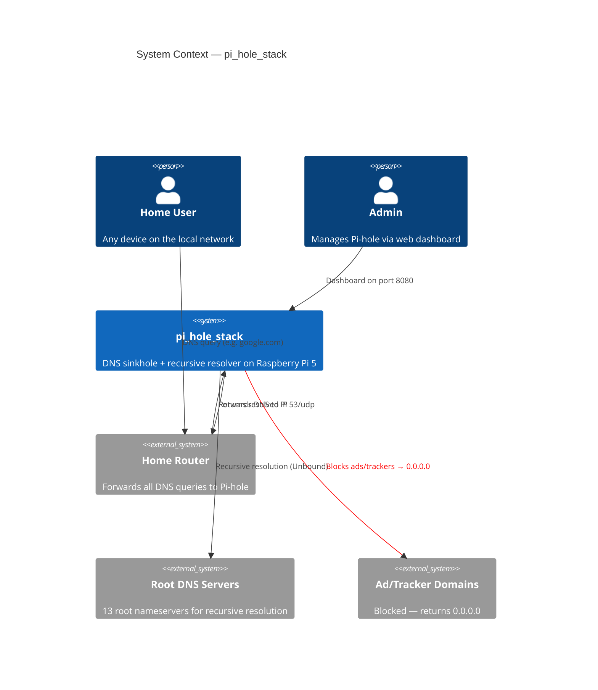
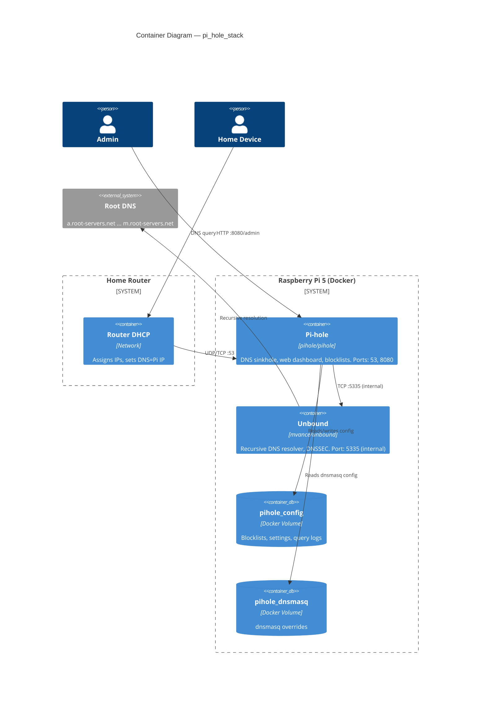
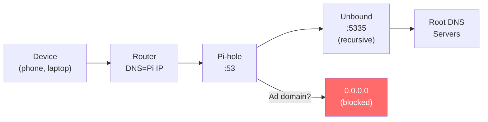

# pi_hole_stack

Network-wide DNS sinkhole and ad blocker running on a Raspberry Pi 5. Deploys Pi-hole + Unbound (recursive DNS resolver) via Docker Compose for full privacy — no queries leave your network to third-party DNS providers like Cloudflare or Google.

## Architecture

### C4 Context Diagram



### C4 Container Diagram



### DNS Resolution Flow



## Prerequisites

| Requirement     | Version           | Notes                                            |
| --------------- | ----------------- | ------------------------------------------------ |
| Raspberry Pi 5  | ARM64             | 4 GB+ RAM recommended                            |
| Raspberry Pi OS | Bookworm (64-bit) | Or any Debian-based ARM64 distro                 |
| Docker          | 24.0+             | `curl -fsSL https://get.docker.com \| sh`        |
| Docker Compose  | v2.20+            | Plugin: `sudo apt install docker-compose-plugin` |

## Quick Start

```bash
# 1. Clone & enter
git clone https://github.com/Adamo-97/pi_setup.git
cd pi_setup/pi_hole_stack

# 2. Run setup (installs everything, starts containers)
chmod +x setup.sh update-gravity.sh
./setup.sh

# 3. Set your admin password
nano .env                  # Change PIHOLE_PASSWORD
docker compose up -d       # Apply

# 4. Configure your router's DNS (see below)

# 5. Access dashboard
# http://<pi-ip>:8080/admin
```

## Folder Structure

```
pi_hole_stack/
├── docker-compose.yml      # Pi-hole + Unbound containers
├── .env.example            # Environment template
├── .gitignore
├── setup.sh                # One-time setup & install
├── update-gravity.sh       # Weekly blocklist update (cron)
├── unbound/
│   └── unbound.conf        # Recursive resolver config
├── pihole/
│   └── custom.list         # Local DNS overrides (optional)
└── README.md               # This file
```

## Configuration

### Environment Variables (`.env`)

| Variable          | Default         | Description                     |
| ----------------- | --------------- | ------------------------------- |
| `PIHOLE_PASSWORD` | `changeme`      | Web dashboard admin password    |
| `PIHOLE_WEB_PORT` | `8080`          | Host port for web dashboard     |
| `HOST_IP`         | `192.168.1.100` | Static IP of the Raspberry Pi   |
| `TZ`              | `Asia/Riyadh`   | Timezone for logs and schedules |

### Setting a Static IP on the Raspberry Pi

Pi-hole must have a predictable IP so the router always knows where to send DNS queries.

**Option A: Via `nmcli` (Raspberry Pi OS Bookworm)**

```bash
# List connections
nmcli con show

# Set static IP (replace values for your network)
sudo nmcli con mod "Wired connection 1" \
    ipv4.addresses 192.168.1.100/24 \
    ipv4.gateway 192.168.1.1 \
    ipv4.dns "127.0.0.1" \
    ipv4.method manual

# Apply
sudo nmcli con up "Wired connection 1"
```

**Option B: Via `/etc/dhcpcd.conf` (older Raspberry Pi OS)**

```bash
sudo nano /etc/dhcpcd.conf
```

Add at the bottom:

```
interface eth0
static ip_address=192.168.1.100/24
static routers=192.168.1.1
static domain_name_servers=127.0.0.1
```

```bash
sudo systemctl restart dhcpcd
```

### Configuring Your Router's DNS

This is the critical step that makes Pi-hole protect **all** devices on your network.

1. **Log into your router** (usually `192.168.1.1` or `192.168.0.1`)
2. **Find DNS settings** — typically under:
   - `DHCP Settings` → `DNS Server`
   - `LAN Settings` → `DNS`
   - `Internet / WAN` → `DNS`
3. **Set Primary DNS** to your Pi's IP: `192.168.1.100`
4. **Remove or leave blank** the Secondary DNS
   - If you must set one, use `1.1.1.1` as fallback (but this bypasses Pi-hole)
5. **Save & reboot router**

**Per-device alternative** (if you can't change router DNS):

```bash
# On any Linux device:
sudo nano /etc/resolv.conf
# Set: nameserver 192.168.1.100

# On macOS:
# System Preferences → Network → Advanced → DNS → add 192.168.1.100

# On Windows:
# Network Settings → Change adapter options → IPv4 → DNS = 192.168.1.100
```

### Local DNS Records

Add custom LAN hostnames in [pihole/custom.list](pihole/custom.list):

```
192.168.1.100 pihole.local
192.168.1.100 pi.home
192.168.1.50  nas.home
```

Apply changes: `docker exec pihole pihole restartdns`

## Maintenance

### Automated Gravity Updates

The `setup.sh` script installs a cron job that runs weekly:

```
0 3 * * 0  /path/to/pi_hole_stack/update-gravity.sh >> /var/log/pihole-gravity-update.log 2>&1
```

This updates Pi-hole's blocklists every **Sunday at 3:00 AM**.

### Manual Gravity Update

```bash
docker exec pihole pihole -g
```

### Useful Commands

```bash
# View Pi-hole logs
docker compose logs -f pihole

# View Unbound logs
docker compose logs -f unbound

# Restart services
docker compose restart

# Stop everything
docker compose down

# Full reset (removes volumes — wipes config!)
docker compose down -v

# Check DNS resolution
docker exec pihole dig @127.0.0.1 google.com +short

# Check Unbound directly
docker exec unbound drill @127.0.0.1 -p 5335 cloudflare.com

# Pi-hole stats from CLI
docker exec pihole pihole -c

# Whitelist a domain
docker exec pihole pihole -w example.com

# Blacklist a domain
docker exec pihole pihole -b ads.example.com

# Tail query log
docker exec pihole pihole -t
```

## Ports

| Port | Protocol | Service     | Description                       |
| ---- | -------- | ----------- | --------------------------------- |
| 53   | TCP/UDP  | Pi-hole DNS | All DNS queries from LAN          |
| 8080 | TCP      | Pi-hole Web | Admin dashboard                   |
| 5335 | TCP      | Unbound     | Internal only (Pi-hole → Unbound) |

## Unbound — Why Recursive DNS?

Standard Pi-hole setups forward queries to upstream providers (Cloudflare `1.1.1.1`, Google `8.8.8.8`). This means those companies see every domain you visit.

With Unbound as a recursive resolver:

- **No upstream provider** sees your full query history
- Queries go directly to authoritative nameservers (root → TLD → domain)
- **DNSSEC** validation is built in
- **Cache prefetching** keeps popular domains fast
- Full control, zero third-party dependency

## Troubleshooting

### Port 53 already in use

```bash
# Find what's using port 53
sudo ss -lntp | grep :53

# If systemd-resolved:
sudo systemctl disable --now systemd-resolved
# Or just disable the stub listener (setup.sh does this automatically):
sudo mkdir -p /etc/systemd/resolved.conf.d
echo -e "[Resolve]\nDNSStubListener=no" | sudo tee /etc/systemd/resolved.conf.d/pihole.conf
sudo systemctl restart systemd-resolved
```

### Pi-hole container won't start

```bash
docker compose logs pihole    # Check error messages
docker compose down && docker compose up -d   # Fresh restart
```

### Unbound health check failing

```bash
docker compose logs unbound
# Verify config syntax:
docker exec unbound unbound-checkconf
```

### DNS not working after setup

```bash
# Test from the Pi itself
dig @127.0.0.1 google.com

# Test from another device
nslookup google.com 192.168.1.100

# If nslookup hangs, check firewall:
sudo iptables -L -n | grep 53
```

## Coexistence with Other Stacks

This stack runs independently alongside other Pi projects:

| Stack              | PostgreSQL | n8n   | Network                       |
| ------------------ | ---------- | ----- | ----------------------------- |
| pi_youtube_stack   | 5433       | 5678  | youtube_stack_net             |
| pi_tiktok_stack    | 5434       | 5679  | tiktok_stack_net              |
| pi_instagram_stack | 5435       | 5680  | instagram_stack_net           |
| pi_x_stack         | 5436       | 5681  | x_stack_net                   |
| **pi_hole_stack**  | **—**      | **—** | **pihole_net (10.0.53.0/24)** |

Pi-hole uses ports **53** (DNS) and **8080** (web) — no overlap with existing stacks.

## License

Private — Adamo-97
