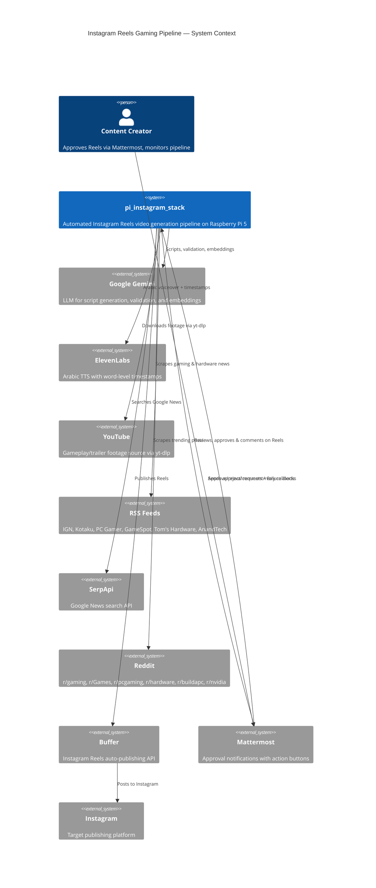
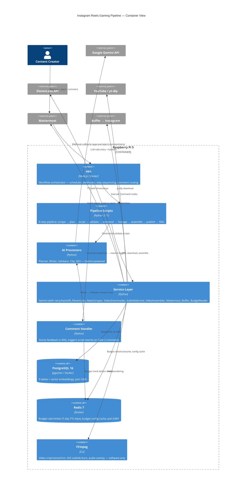
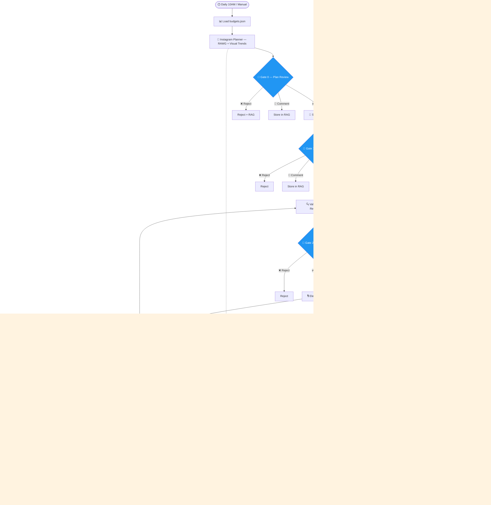

# 📸 pi_instagram_stack

Fully automated Instagram Reels gaming content pipeline for Raspberry Pi 5. Scrapes trending gaming & hardware news, generates Arabic scripts with AI, produces voiceover with word-level timestamps, downloads gameplay footage, assembles vertical 9:16 Reels with burnt-in word-by-word Arabic subtitles, and publishes to Instagram via Buffer — all orchestrated by n8n.

---

## Architecture

### C4 Context Diagram


```mermaid
C4Context
    title Instagram Reels Gaming Pipeline — System Context

    Person(creator, "Content Creator", "Approves Reels via Mattermost, monitors pipeline")

    System(instagram_stack, "pi_instagram_stack", "Automated Instagram Reels video generation pipeline on Raspberry Pi 5")

    System_Ext(gemini, "Google Gemini", "LLM for script generation, validation, and embeddings")
    System_Ext(elevenlabs, "ElevenLabs", "Arabic TTS with word-level timestamps")
    System_Ext(youtube, "YouTube", "Gameplay/trailer footage source via yt-dlp")
    System_Ext(rss_feeds, "RSS Feeds", "IGN, Kotaku, PC Gamer, GameSpot, Tom's Hardware, AnandTech")
    System_Ext(serpapi, "SerpApi", "Google News search API")
    System_Ext(reddit, "Reddit", "r/gaming, r/Games, r/pcgaming, r/hardware, r/buildapc, r/nvidia")
    System_Ext(buffer, "Buffer", "Instagram Reels auto-publishing API")
    System_Ext(mattermost, "Mattermost", "Approval notifications with action buttons")
    System_Ext(instagram, "Instagram", "Target publishing platform")

    Rel(creator, mattermost, "Reviews, approves & comments on Reels")
    Rel(instagram_stack, gemini, "Scripts, validation, embeddings")
    Rel(instagram_stack, elevenlabs, "Arabic voiceover + timestamps")
    Rel(instagram_stack, youtube, "Downloads footage via yt-dlp")
    Rel(instagram_stack, rss_feeds, "Scrapes gaming & hardware news")
    Rel(instagram_stack, serpapi, "Searches Google News")
    Rel(instagram_stack, reddit, "Scrapes trending posts")
    Rel(instagram_stack, mattermost, "Sends approval requests + failure alerts")
    Rel(instagram_stack, buffer, "Publishes Reels")
    Rel(buffer, instagram, "Posts to Instagram")
    Rel(mattermost, instagram_stack, "Approve/reject/comment/retry callbacks")
```

### C4 Container Diagram


```mermaid
C4Container
    title Instagram Reels Gaming Pipeline — Container View

    Person(creator, "Content Creator")

    Container_Boundary(pi, "Raspberry Pi 5") {
        Container(n8n, "n8n", "Node.js / Docker", "Workflow orchestrator — schedules, webhooks, step sequencing, comment routing")
        Container(pipeline, "Pipeline Scripts", "Python 3.11", "8-step pipeline: scrape → plan → script → validate → voiceover → footage → assemble → publish → RAG")
        Container(processors, "AI Processors", "Python", "Planner, Writer, Validator, Clip, SEO — Gemini-powered")
        Container(services, "Service Layer", "Python", "Gemini (with retry/backoff), ElevenLabs, NewsScraper, VideoDownloader, SubtitleService, VideoAssembler, Mattermost, Buffer, BudgetReader")
        Container(comment, "Comment Handler", "Python", "Stores feedback in RAG, triggers script rewrite on Gate 2 comments")
        ContainerDb(postgres, "PostgreSQL 16", "pgvector / Docker", "9 tables + vector embeddings, port 5435")
        ContainerDb(redis, "Redis 7", "Docker", "Budget rate limiter (7-day TTL keys), budget config cache, port 6381")
        Container(ffmpeg, "FFmpeg", "CLI", "Video crop/resize/trim, ASS subtitle burn, audio overlay — software-only")
    }

    System_Ext(gemini, "Google Gemini API")
    System_Ext(elevenlabs, "ElevenLabs API")
    System_Ext(youtube, "YouTube / yt-dlp")
    System_Ext(mattermost, "Mattermost")
    System_Ext(buffer, "Buffer → Instagram")

    Rel(creator, mattermost, "Approve / reject / comment")
    Rel(n8n, pipeline, "Execute Command nodes")
    Rel(n8n, comment, "Comment webhook → rewrite trigger")
    Rel(pipeline, processors, "Generate & validate scripts")
    Rel(pipeline, services, "TTS, download, assemble")
    Rel(processors, gemini, "LLM calls (retry + backoff)")
    Rel(services, elevenlabs, "TTS with timestamps")
    Rel(services, youtube, "yt-dlp download")
    Rel(services, postgres, "Read/write all data")
    Rel(services, redis, "Budget check/consume, config cache")
    Rel(services, ffmpeg, "Video rendering")
    Rel(services, mattermost, "Notifications + failure alerts")
    Rel(services, buffer, "Publish Reel")
    Rel(mattermost, n8n, "Webhook callbacks (approve/reject/comment/retry)")
    Rel(comment, processors, "Writer → Validator revision loop")
    Rel(comment, redis, "Budget check before rewrite")
```

---

## Pipeline Flow (5-Gate Human-in-the-Loop)

Every phase requires **explicit human approval** via Mattermost before proceeding. Nothing proceeds past any gate without your click.


```mermaid
flowchart TD
    START([🕐 Daily 10AM / Manual]) --> BUDGET[📊 Load budgets.json]
    BUDGET --> PLAN[🧠 Instagram Planner — RAWG + Visual Trends]

    PLAN --> GATE0{🔔 Gate 0 — Plan Review}
    GATE0 -- ✅ Approve --> SCRAPE[📰 Scrape News]
    GATE0 -- ❌ Reject --> R0[Reject + RAG]
    GATE0 -- 💬 Comment --> C0[Store in RAG]

    SCRAPE --> GATE1{🔔 Gate 1 — Data Review}
    GATE1 -- ✅ Approve --> SCRIPT[✍️ Writer — Reels Script]
    GATE1 -- ❌ Reject --> R1[Reject]
    GATE1 -- 💬 Comment --> C1[Store in RAG]

    SCRIPT --> VALIDATE[🔍 Validator — Auto-Revision Loop]
    VALIDATE --> GATE2{🔔 Gate 2 — Script Review}
    GATE2 -- ✅ Approve --> VOICE[🎙️ ElevenLabs TTS]
    GATE2 -- ❌ Reject --> R2[Reject]
    GATE2 -- 💬 Comment --> REWRITE

    subgraph REWRITE[Comment-Triggered Rewrite]
        CBUDGET{💰 Budget Check} -- Sufficient --> CWRITER[✍️ Writer Rewrite]
        CWRITER --> CVALIDATE[🔍 Validator Loop]
        CVALIDATE -- ✅ Pass --> NEWGATE2[New Gate 2 Message]
        CVALIDATE -- ❌ 10x Fail --> CFAIL[❌ Generation Failed + 🔄 Try Again]
        CBUDGET -- Insufficient --> CSKIP[⚠️ Comment Stored, Rewrite Skipped]
    end

    VOICE --> GATE3{🔔 Gate 3 — Audio Review}
    GATE3 -- ✅ Approve --> FOOTAGE[📹 Download + Assemble]
    GATE3 -- ❌ Reject --> R3[Reject]

    FOOTAGE --> GATE4{🔔 Gate 4 — Publish Review + 📎 Thumbnail}
    GATE4 -- ✅ + 🖼️ Thumbnail --> BUFFER[📤 Buffer → Instagram]
    GATE4 -- ❌ Reject --> R4[Reject]
    GATE4 -- 💬 Comment --> C4[Store SEO Feedback in RAG]

    BUFFER --> RAG[🧠 Update RAG]

    CFAIL -- 🔄 Try Again --> FRESHSCRIPT[✍️ Fresh Script — Clean Slate]
    FRESHSCRIPT --> VALIDATE

    SCRIPT -.-> REDIS[🔴 Redis Rate Limiter]
    VOICE -.-> REDIS
    FOOTAGE -.-> REDIS
    PLAN -.-> REDIS

    style GATE0 fill:#2196F3,color:#fff
    style GATE1 fill:#2196F3,color:#fff
    style GATE2 fill:#2196F3,color:#fff
    style GATE3 fill:#2196F3,color:#fff
    style GATE4 fill:#2196F3,color:#fff
    style REDIS fill:#f44336,color:#fff
    style REWRITE fill:#FFF3E0,stroke:#FF9800
    style CFAIL fill:#FFCDD2,stroke:#d00000
```

### Approval Gates Summary

| Gate | Phase | Channel | What You Review | Comment Button |
|------|-------|---------|-----------------|----------------|
| **Gate 0** | Plan | #plan | Planner's content plan (game, visual angle) | ✅ Stored in RAG |
| **Gate 1** | Data | #news | Scraped news articles (relevance, quality) | ✅ Stored in RAG |
| **Gate 2** | Script | #script | AI-generated Arabic script + validation scores | ✅ **Triggers rewrite loop** |
| **Gate 3** | Audio | #voiceover | ElevenLabs voiceover + word timestamps | ❌ No comment button |
| **Gate 4** | Publish | #publish | Final review + manual thumbnail upload | ✅ SEO feedback stored in RAG |

### Comment System

Comments work differently depending on the gate:

- **Gates 0, 1, 4**: Comment is stored in `feedback_log` + embedded in RAG. Future scripts learn from it, but no immediate action.
- **Gate 2 (Script)**: Comment triggers a full **writer → validator revision loop**:
  1. Budget check — estimates worst-case cost (~930 units). If insufficient, comment is stored but rewrite is skipped with a Mattermost warning.
  2. Writer rewrites the script using your comment as revision feedback.
  3. Validator scores the new script (needs 95+/100 overall, 70+ hook).
  4. If rejected, loops up to 10 more times with auto-generated feedback.
  5. If approved → new Gate 2 message appears for your review.
  6. If all 10 retries fail → you get a "❌ Generation Failed" message with a "🔄 Try Again" button that starts a completely fresh script (clean slate, no revision baggage).
- **Gate 3**: No comment button (voiceover is audio, text comments don't apply).

---

## Resilience Patterns

### Gemini API (gemini_service.py)

- **Exponential backoff with jitter**: `2^attempt + random(0, 1)` seconds between retries
- **429 rate limit handling**: Reads `Retry-After` header and sleeps accordingly
- **503 service unavailable**: Retries with backoff
- **Other 4xx errors**: Raises immediately (no wasted retries)
- **Max retries**: 5 (default, configurable per call)
- Applied to: `generate_text`, `generate_json`, `generate_embedding`, `generate_embeddings_batch`

### Embedding Service (embedding_service.py)

- Wraps all Gemini embedding calls in try/except
- Returns `[]` on failure instead of crashing the pipeline
- Prevents RAG storage failures from killing the main flow

### Budget Drain Protection

- **Redis rate limiter** enforces weekly per-platform budgets (1000 units/week for Instagram)
- **Budget check before comment rewrites**: Estimates worst-case cost before entering the revision loop
- **Generation failure cap**: Validator stops after 10 revision attempts — never burns budget infinitely
- All budget values read from `budgets.json` at runtime (never hardcoded)

---

## Validation Criteria

The Validator scores scripts on 7 Instagram-specific criteria (0-100):

| Criterion | Description | Threshold |
|-----------|-------------|-----------|
| `hook_strength` | First 3 seconds impact | **≥70** (auto-reject below) |
| `accuracy` | Factual correctness vs sources | — |
| `pacing` | Speaking speed for 30-60s format | — |
| `engagement` | Viewer retention signals | — |
| `language_quality` | Arabic fluency and naturalness | — |
| `cta_effectiveness` | Call-to-action strength | — |
| `instagram_fit` | Platform aesthetic quality & Instagram style | — |

**Overall threshold: ≥95** to pass. Failed scripts get up to **10 auto-revisions** with detailed Arabic feedback sent back to the Writer each time.

When all 10 revisions fail:
- `generation_failed` flag is set (rejected content is NOT returned to the pipeline)
- Mattermost notification with last score and attempt count
- "🔄 Try Again" button triggers a fresh script generation from scratch

---

## Prerequisites

### System Requirements

- **Raspberry Pi 5** (4GB+ RAM recommended)
- **Raspberry Pi OS** (64-bit / Bookworm)
- **Storage**: 10GB+ free for videos and footage

### Software

```bash
# Docker & Docker Compose
curl -fsSL https://get.docker.com | sh
sudo usermod -aG docker $USER
sudo apt-get install -y docker-compose-plugin

# FFmpeg (required for video assembly)
sudo apt-get install -y ffmpeg

# Python 3.11+
sudo apt-get install -y python3 python3-pip python3-venv

# Arabic fonts
sudo apt-get install -y fonts-dejavu-core fonts-noto fonts-arabeyes
```

### API Keys Required

| Service | Key | Purpose |
|---------|-----|---------|
| **Google Gemini** | `GEMINI_API_KEY` | Script generation, validation, embeddings |
| **ElevenLabs** | `ELEVENLABS_API_KEY` + `ELEVENLABS_VOICE_ID` | Arabic TTS with word timestamps |
| **Mattermost** | `MATTERMOST_URL` + `MATTERMOST_BOT_TOKEN` + channel IDs | Approval notifications |
| **Buffer** | `BUFFER_ACCESS_TOKEN` + `BUFFER_PROFILE_ID` | Instagram Reels publishing |
| **SerpApi** _(optional)_ | `SERPAPI_KEY` | Google News search |

---

## Quick Start

### Option 1: Automated Setup

```bash
git clone <repo-url> pi_instagram_stack
cd pi_instagram_stack
chmod +x setup.sh
./setup.sh
```

### Option 2: Manual Setup

```bash
cd pi_instagram_stack

# 1. Environment
cp .env.example .env
nano .env  # Add your API keys

# 2. Python
python3 -m venv venv
source venv/bin/activate
pip install -r requirements.txt

# 3. Directories
mkdir -p output/{videos,voiceovers,scripts,subtitles,temp} footage

# 4. Docker services
docker compose up -d

# 5. Import n8n workflow
# Open http://<pi-ip>:5678  (shared n8n from pi_n8n_stack)
# Import → n8n_workflow.json
```

### Option 3: Docker Only

```bash
cp .env.example .env && nano .env
docker compose up -d
```

---

## Project Structure

```
pi_instagram_stack/
├── config/
│   ├── __init__.py
│   ├── settings.py              # Centralized config (Gemini, ElevenLabs, DB, Mattermost, Redis, Budget)
│   ├── budgets.json             # Per-platform weekly budget quotas + API costs
│   └── prompts/
│       ├── __init__.py
│       ├── writer_prompts.py    # Arabic Instagram Reels script templates
│       └── validator_prompts.py # 7-criteria quality gate prompts
├── database/
│   ├── __init__.py
│   ├── init.sql                 # 9 tables + pgvector extension
│   ├── connection.py            # ThreadedConnectionPool
│   ├── models.py                # Pydantic v2 data models
│   └── rag_manager.py           # RAG embeddings + feedback storage/retrieval
├── services/
│   ├── __init__.py
│   ├── gemini_service.py        # Gemini text/JSON/embeddings (retry + backoff + 429 handling)
│   ├── elevenlabs_service.py    # TTS + word-level timestamps
│   ├── embedding_service.py     # Embedding wrapper (graceful failure → empty list)
│   ├── news_scraper.py          # RSS + Google News + Reddit
│   ├── video_downloader.py      # yt-dlp + local fallback
│   ├── subtitle_service.py      # ASS subtitle generation (word-by-word karaoke)
│   ├── video_assembler.py       # FFmpeg vertical video assembly (software-only)
│   ├── mattermost_service.py    # 5-gate HITL approval + comment buttons + failure alerts
│   ├── buffer_service.py        # Buffer API → Instagram Reels publishing
│   ├── redis_rate_limiter.py    # Redis-backed budget enforcement (7-day TTL)
│   └── budget_reader.py         # Loads budgets.json from Nextcloud/Redis/local
├── processors/
│   ├── __init__.py
│   ├── base.py                  # Abstract base with RAG helpers, word counting, duration estimation
│   ├── planner.py               # Content planner — RAWG cache + visual trends (Gate 0)
│   ├── writer.py                # Arabic script generation (revision-aware)
│   ├── validator.py             # 7-criteria quality validation + auto-revision loop (max 10)
│   ├── clip.py                  # AI footage selection
│   └── seo.py                   # SEO metadata generation
├── pipeline/
│   ├── __init__.py
│   ├── step1_scrape_news.py     # Scrape RSS/Google/Reddit
│   ├── step2_generate_script.py # Generate Arabic Reels script via Writer
│   ├── step3_validate_script.py # Validator quality gate + auto-revision + failure notification
│   ├── step4_generate_voiceover.py # ElevenLabs TTS + timestamps
│   ├── step5_download_footage.py   # yt-dlp gameplay download
│   ├── step5_publish_reels.py      # Mattermost notify for publish gate
│   ├── step5b_buffer_draft.py      # Buffer API draft creation
│   ├── step6_assemble_video.py     # FFmpeg 9:16 video assembly
│   ├── step6_update_rag.py         # RAG memory update
│   ├── step7_publish_reels.py      # Final publish flow
│   ├── step8_update_rag.py         # Post-publish RAG update
│   ├── comment_handler.py          # Mattermost comment processing + gate 2 rewrite trigger
│   ├── gate_helper.py              # Sends gate approval messages to Mattermost
│   ├── update_gate_post.py         # Updates gate post after approve/reject/comment
│   ├── save_state.py               # Saves pipeline state to /tmp
│   └── read_state.py               # Reads pipeline state from /tmp
├── footage/                     # Local footage library (.gitkeep)
├── output/                      # Generated videos, voiceovers, scripts
├── docker-compose.yml           # PostgreSQL (5435) + Redis (6381)
├── n8n_workflow.json            # Complete n8n workflow (5-gate HITL + comment routing + retry)
├── requirements.txt             # Python dependencies
├── setup.sh                     # One-click setup script
├── .env.example                 # Environment template
├── .gitignore
└── README.md
```

---

## Docker Services

| Service | Image | Port | Memory | Purpose |
|---------|-------|------|--------|---------|
| `postgres_instagram` | `pgvector/pgvector:pg16` | `5435` | 512 MB | Database + vector embeddings |
| `redis_instagram` | `redis:7-alpine` | `6381` | 64 MB | Rate limiting + budget cache |

n8n runs on the shared `pi_n8n_stack` instance (port 5678, host network).

All containers run on an isolated Docker bridge network `instagram_stack_net`.

> **Note:** These ports are isolated from `pi_youtube_stack` (5433) and `pi_tiktok_stack` (5434) so all stacks can run simultaneously.

---

## Database Schema

9 tables in `instagram_rag` database:

| Table | Purpose |
|-------|---------|
| `news_articles` | Scraped news (source, URL, title, summary, used flag) |
| `generated_scripts` | Arabic Reels scripts with news_ids linkage |
| `validations` | 7-criteria scores + approval decision |
| `voiceovers` | ElevenLabs audio + word_timestamps JSONB |
| `video_footage` | Downloaded clips (YouTube/local) |
| `rendered_videos` | Final videos + Buffer publish status |
| `rag_embeddings` | 3072-dim vectors (gemini-embedding-001), sequential scan |
| `feedback_log` | User comments + auto feedback for RAG context |
| `pipeline_runs` | Execution history and status |

---

## Subtitle System

Instagram-viral **word-by-word Arabic karaoke** subtitles:

- Gold highlight (`#FFD700`) on the currently spoken word
- White (`#FFFFFF`) for other words in the group
- Semi-transparent black background bar
- ASS subtitle format with centisecond timing
- Positioned at 70% screen height (Reels safe zone)
- Groups of 4 words per subtitle frame

---

## Content Types

| Type | Trigger | Description |
|------|---------|-------------|
| `trending_news` | Daily 9AM auto | Top 2-3 gaming news stories |
| `game_spotlight` | Manual webhook | Deep dive on a single game |
| `hardware_spotlight` | Manual webhook | Hardware/tech product spotlight |
| `trailer_reaction` | Manual webhook | Commentary over new trailers |

---

## n8n Workflow

Import `n8n_workflow.json` into n8n at `http://<pi-ip>:5678` (the shared `pi_n8n_stack` instance).

The workflow implements the **5-Gate HITL** pattern with comment handling and retry support.

### Webhooks

| Path | Method | Purpose |
|------|--------|---------|
| `instagram-manual` | POST | Manual pipeline trigger |
| `instagram-approve` | GET | Gate approval callback |
| `instagram-reject` | GET | Gate rejection callback |
| `instagram-comment` | POST | Comment button → opens Mattermost dialog |
| `instagram-dialog-response` | POST | Receives comment text from dialog |
| `instagram-retry-script` | GET | "Try Again" button → fresh script generation |

### Comment Flow in n8n

```
Comment Webhook → Open Dialog → Dialog Response Webhook → Handle Comment (Python)
    → Check Comment Result (Code node)
        → rewrite_triggered + approved → Send new script to Gate 2
        → rewrite_triggered + generation_failed → End (failure already notified)
        → stored only (gates 0,1,4) → End
```

### Retry Flow in n8n

```
Retry Script Webhook → Parse Params → Fresh Write Script → Validate → Gate 2
```

---

## Running Individual Steps

```bash
source venv/bin/activate

# Scrape news
python -m pipeline.step1_scrape_news --source all

# Generate script
python -m pipeline.step2_generate_script --type trending_news --duration 45

# Validate (with auto-revision, up to 10 retries)
python -m pipeline.step3_validate_script --script-id <UUID>

# Generate voiceover
python -m pipeline.step4_generate_voiceover --script-id <UUID>

# Download footage
python -m pipeline.step5_download_footage --script-id <UUID>

# Assemble video
python -m pipeline.step6_assemble_video \
    --script-id <UUID> \
    --voiceover-id <UUID> \
    --footage-id <UUID>

# Publish
python -m pipeline.step7_publish_reels --video-id <UUID> --mode notify
python -m pipeline.step7_publish_reels --video-id <UUID> --mode publish

# Update RAG
python -m pipeline.step8_update_rag --video-id <UUID>

# Process a comment manually
python -m pipeline.comment_handler --run-id <UUID> --gate 2 --comment "your feedback"
```

---

## Budget System

Weekly budgets are enforced via Redis with 7-day TTL keys. All values come from `config/budgets.json`:

| Platform | Weekly Units |
|----------|-------------|
| YouTube | 2000 |
| TikTok | 1000 |
| **Instagram** | **1000** |
| X | 1000 |

### API Costs

| API Call | Units |
|----------|-------|
| `gemini_script` (Writer) | 50 |
| `gemini_validate` (Validator) | 30 |
| `gemini_planner` | 25 |
| `gemini_metadata` (SEO) | 20 |
| `gemini_clip_plan` | 15 |
| `gemini_embedding` | 5 |
| `elevenlabs_per_minute` | 100 |
| `serpapi_search` | 10 |
| `rawg_fetch` | 2 |

### Worst-Case Budget per Run

A single pipeline run with 10 validation retries: `50 + 11×(30+50) = 930 units` (93% of weekly Instagram budget). The budget check on comment-triggered rewrites prevents accidental exhaustion.

---

## Coexistence with Other Stacks

| Resource | YouTube Stack | TikTok Stack | Instagram Stack |
|----------|---------------|--------------|-----------------|
| PostgreSQL port | 5433 | 5434 | **5435** |
| n8n port | 5678 (shared) | 5678 (shared) | **5678 (shared)** |
| Redis port | — | — | **6381** |
| Docker network | `youtube_stack_net` | `tiktok_stack_net` | `instagram_stack_net` |
| Database name | `youtube_rag` | `tiktok_rag` | `instagram_rag` |
| DB user | `yt_user` | `tt_user` | `ig_user` |

All stacks run independently on the same Pi 5 with no resource conflicts.

---

## License

Private project — not for redistribution.
