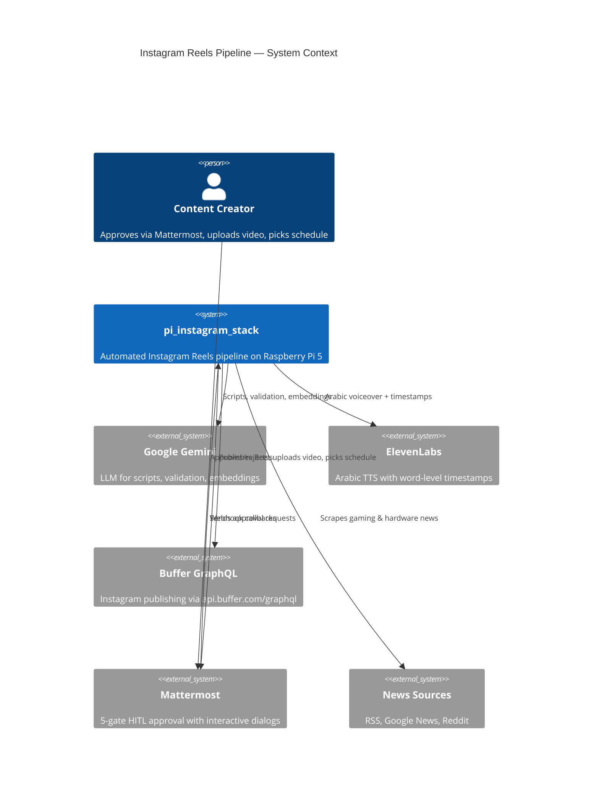
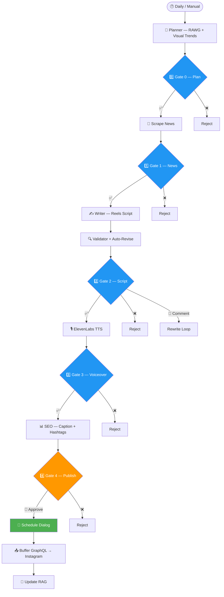

# 📸 pi_instagram_stack

Automated Instagram Reels Arabic gaming content pipeline on Raspberry Pi 5. Scrapes trending gaming & hardware news, generates Arabic scripts with AI, produces voiceover with word-level timestamps, and publishes to Instagram via Buffer's GraphQL API — orchestrated by n8n with 5-gate human-in-the-loop approval.

---

## Architecture


```mermaid
C4Context
    title Instagram Reels Pipeline — System Context

    Person(creator, "Content Creator", "Approves via Mattermost, uploads video, picks schedule")
    System(ig_stack, "pi_instagram_stack", "Automated Instagram Reels pipeline on Raspberry Pi 5")
    System_Ext(gemini, "Google Gemini", "LLM for scripts, validation, embeddings")
    System_Ext(elevenlabs, "ElevenLabs", "Arabic TTS with word-level timestamps")
    System_Ext(buffer, "Buffer GraphQL", "Instagram publishing via api.buffer.com/graphql")
    System_Ext(mattermost, "Mattermost", "5-gate HITL approval with interactive dialogs")
    System_Ext(news, "News Sources", "RSS, Google News, Reddit")

    Rel(creator, mattermost, "Approves/rejects, uploads video, picks schedule")
    Rel(ig_stack, gemini, "Scripts, validation, embeddings")
    Rel(ig_stack, elevenlabs, "Arabic voiceover + timestamps")
    Rel(ig_stack, buffer, "Publishes Reels")
    Rel(ig_stack, mattermost, "Sends approval requests")
    Rel(ig_stack, news, "Scrapes gaming & hardware news")
    Rel(mattermost, ig_stack, "Webhook callbacks")
```

---

## Pipeline Flow (5-Gate Human-in-the-Loop)


```mermaid
flowchart TD
    START([🕐 Daily / Manual]) --> PLAN[🧠 Planner — RAWG + Visual Trends]

    PLAN --> GATE0{0️⃣ Gate 0 — Plan}
    GATE0 -- ✅ --> SCRAPE[📰 Scrape News]
    GATE0 -- ❌ --> R0[Reject]

    SCRAPE --> GATE1{1️⃣ Gate 1 — News}
    GATE1 -- ✅ --> SCRIPT[✍️ Writer — Reels Script]
    GATE1 -- ❌ --> R1[Reject]

    SCRIPT --> VALIDATE[🔍 Validator + Auto-Revise]
    VALIDATE --> GATE2{2️⃣ Gate 2 — Script}
    GATE2 -- ✅ --> VOICE[🎙️ ElevenLabs TTS]
    GATE2 -- ❌ --> R2[Reject]
    GATE2 -- 💬 Comment --> REWRITE[Rewrite Loop]

    VOICE --> GATE3{3️⃣ Gate 3 — Voiceover}
    GATE3 -- ✅ --> SEO[📊 SEO — Caption + Hashtags]
    GATE3 -- ❌ --> R3[Reject]

    SEO --> GATE4{4️⃣ Gate 4 — Publish}
    GATE4 -- 🚀 Approve --> DIALOG[📅 Schedule Dialog]
    GATE4 -- ❌ --> R4[Reject]

    DIALOG --> BUFFER[📤 Buffer GraphQL → Instagram]
    BUFFER --> RAG[🧠 Update RAG]

    style GATE0 fill:#2196F3,color:#fff
    style GATE1 fill:#2196F3,color:#fff
    style GATE2 fill:#2196F3,color:#fff
    style GATE3 fill:#2196F3,color:#fff
    style GATE4 fill:#FF9800,color:#fff
    style DIALOG fill:#4CAF50,color:#fff
```

### Gate 4 — Publish Flow

1. Pipeline generates SEO caption (Arabic + English), hashtags, and best post time
2. Gate 4 message shows all SEO data in #ig-publish-private
3. You reply with video + thumbnail attachments
4. Click "🚀 موافقة ونشر" → scheduling dialog opens
5. Pick date/time (YYYY-MM-DD HH:MM KSA) or "publish now"
6. Pipeline fetches your uploaded files, pushes to Buffer with schedule
7. Instagram requires video — text-only drafts won't publish

### Approval Gates

| Gate | Channel | What You Review |
|------|---------|-----------------|
| 0️⃣ | #instagram-plan | Content plan (game, visual angle) |
| 1️⃣ | #instagram-news | Scraped news articles |
| 2️⃣ | #instagram-script | Arabic script + validation scores |
| 3️⃣ | #instagram-voiceover | ElevenLabs voiceover audio |
| 4️⃣ | #ig-publish-private | SEO caption + hashtags → upload video → schedule |

---

## Pipeline Steps

| Step | File | Description |
|------|------|-------------|
| 1 | `step1_scrape_news.py` | Scrape RSS/Google/Reddit |
| 2 | `step2_generate_script.py` | Generate Arabic Reels script |
| 3 | `step3_validate_script.py` | AI quality gate + auto-revision (up to 10 retries) |
| 4 | `step4_generate_voiceover.py` | ElevenLabs TTS + timestamps |
| 5 | `step5_publish_reels.py` | Generate SEO caption + hashtags |
| 5b | `step5b_buffer_draft.py` | Push to Buffer (video/scheduled) |
| 6 | `step6_update_rag.py` | Update RAG memory |

## Content Types

| Type | Description |
|------|-------------|
| `trending_news` | Top 2-3 gaming news stories |
| `game_spotlight` | Deep dive on a single game |
| `hardware_spotlight` | Hardware/tech product spotlight |
| `trailer_reaction` | Commentary over new trailers |

## Stack Coexistence

| Stack | PostgreSQL | Redis | Trigger | Database |
|-------|-----------|-------|---------|----------|
| pi_tiktok_stack | 5434 | 6380 | 10AM | tiktok_rag |
| **pi_instagram_stack** | **5435** | **6381** | **—** | **instagram_rag** |
| pi_x_stack | 5436 | 6382 | 2PM | x_rag |

All stacks share the single n8n instance on port 5678 (host network).

## Docker Services

| Container | Image | Port | Purpose |
|-----------|-------|------|---------|
| `postgres_instagram` | `pgvector/pgvector:pg16` | 5435 | Database + vector embeddings |
| `redis_instagram` | `redis:7-alpine` | 6381 | Rate limiting + budget cache |

## Gemini Model Routing

| Task | Model |
|------|-------|
| Planner | gemini-2.5-flash |
| Scraper | gemini-2.5-flash |
| Validator | gemini-2.5-flash |
| Writer + SEO | gemini-3.1-pro-preview |

## Buffer Integration

Uses Buffer GraphQL API (`https://api.buffer.com/graphql`):
- Channel: `67ab8b3acc7f0c250ca5f8ea` (instagram, @tvv_arabic)
- Instagram requires at least one image or video — text-only posts will fail

## Validation

7 criteria scored 0-100. Overall threshold: ≥95. Hook strength: ≥70. Up to 10 auto-revisions. Failed scripts get a "🔄 Try Again" button for fresh generation.

## Quick Start

```bash
cd ~/pi_setup/pi_instagram_stack
docker compose up -d
# Trigger: POST http://192.168.0.11:5678/webhook/instagram-manual
```

## n8n Webhooks

| Path | Purpose |
|------|---------|
| `instagram-manual` | Manual pipeline trigger |
| `instagram-approve` | Gate approval callback |
| `instagram-reject` | Gate rejection callback |
| `instagram-comment` | Comment button → dialog |
| `instagram-publish-dialog` | Publish approve → scheduling dialog |
| `instagram-publish-submit` | Dialog submit → fetch files → Buffer |
| `instagram-dialog-submit` | Comment dialog submit |
| `instagram-retry-script` | Retry failed script generation |

## Schedule

- **Automatic**: Via n8n (workflow `sqViD3E6dz0znM8y`)
- **Manual**: `curl -X POST http://192.168.0.11:5678/webhook/instagram-manual`

## Project Structure

```
pi_instagram_stack/
├── config/
│   ├── settings.py
│   └── prompts/
├── database/
│   ├── init.sql, connection.py, rag_manager.py
├── services/
│   ├── gemini_service.py, news_scraper.py
│   ├── mattermost_service.py    # 5-gate HITL + publish dialog
│   └── buffer_service.py        # Buffer GraphQL API
├── processors/
│   ├── planner.py, writer.py, validator.py, clip.py, seo.py
├── pipeline/
│   ├── step1–step6, gate_helper.py
│   ├── open_publish_dialog.py
│   └── handle_publish_submit.py
├── docker-compose.yml
├── n8n_workflow.json
└── .env
```

## License

Private — Adamo-97
