# 📸 pi_instagram_stack

Fully automated Instagram Reels gaming content pipeline for Raspberry Pi 5. Scrapes trending gaming & hardware news, generates Arabic scripts with AI, produces voiceover with word-level timestamps, downloads gameplay footage, assembles vertical 9:16 Reels with burnt-in word-by-word Arabic subtitles, and publishes to Instagram via Buffer — all orchestrated by n8n.

---

## Architecture

### C4 Context Diagram

```mermaid
C4Context
    title Instagram Reels Gaming Pipeline — System Context

    Person(creator, "Content Creator", "Approves Reels via Mattermost, monitors pipeline")

    System(instagram_stack, "pi_instagram_stack", "Automated Instagram Reels video generation pipeline on Raspberry Pi 5")

    System_Ext(gemini, "Google Gemini", "LLM for script generation, validation, and embeddings")
    System_Ext(elevenlabs, "ElevenLabs", "Arabic TTS with word-level timestamps")
    System_Ext(youtube, "YouTube", "Gameplay/trailer footage source via yt-dlp")
    System_Ext(rss_feeds, "RSS Feeds", "IGN, Kotaku, PC Gamer, GameSpot, Tom's Hardware, AnandTech")
    System_Ext(serpapi, "SerpApi", "Google News search API")
    System_Ext(reddit, "Reddit", "r/gaming, r/Games, r/pcgaming, r/hardware, r/buildapc, r/nvidia")
    System_Ext(buffer, "Buffer", "Instagram Reels auto-publishing API")
    System_Ext(mattermost, "Mattermost", "Approval notifications with action buttons")
    System_Ext(instagram, "Instagram", "Target publishing platform")

    Rel(creator, mattermost, "Reviews & approves Reels")
    Rel(instagram_stack, gemini, "Scripts, validation, embeddings")
    Rel(instagram_stack, elevenlabs, "Arabic voiceover + timestamps")
    Rel(instagram_stack, youtube, "Downloads footage via yt-dlp")
    Rel(instagram_stack, rss_feeds, "Scrapes gaming & hardware news")
    Rel(instagram_stack, serpapi, "Searches Google News")
    Rel(instagram_stack, reddit, "Scrapes trending posts")
    Rel(instagram_stack, mattermost, "Sends approval requests")
    Rel(instagram_stack, buffer, "Publishes Reels")
    Rel(buffer, instagram, "Posts to Instagram")
    Rel(mattermost, instagram_stack, "Approve/reject callbacks")
```



### C4 Container Diagram

```mermaid
C4Container
    title Instagram Reels Gaming Pipeline — Container View

    Person(creator, "Content Creator")

    Container_Boundary(pi, "Raspberry Pi 5") {
        Container(n8n, "n8n", "Node.js / Docker", "Workflow orchestrator — schedules, webhooks, step sequencing")
        Container(pipeline, "Pipeline Scripts", "Python 3.11", "8-step pipeline: scrape → script → validate → voiceover → footage → assemble → publish → RAG")
        Container(agents, "AI Agents", "Python", "WriterAgent, ValidatorAgent, ClipAgent — Gemini-powered")
        Container(services, "Service Layer", "Python", "Gemini, ElevenLabs, NewsScraper, VideoDownloader, SubtitleService, VideoAssembler, Mattermost, Buffer")
        ContainerDb(postgres, "PostgreSQL 16", "pgvector / Docker", "9 tables + vector embeddings, port 5435")
        Container(ffmpeg, "FFmpeg", "CLI", "Video crop/resize/trim, ASS subtitle burn, audio overlay")
    }

    System_Ext(gemini, "Google Gemini API")
    System_Ext(elevenlabs, "ElevenLabs API")
    System_Ext(youtube, "YouTube / yt-dlp")
    System_Ext(mattermost, "Mattermost")
    System_Ext(buffer, "Buffer → Instagram")

    Rel(creator, mattermost, "Approve / reject")
    Rel(n8n, pipeline, "Execute Command nodes")
    Rel(pipeline, agents, "Generate & validate scripts")
    Rel(pipeline, services, "TTS, download, assemble")
    Rel(agents, gemini, "LLM calls")
    Rel(services, elevenlabs, "TTS with timestamps")
    Rel(services, youtube, "yt-dlp download")
    Rel(services, postgres, "Read/write all data")
    Rel(services, ffmpeg, "Video rendering")
    Rel(services, mattermost, "Notifications")
    Rel(services, buffer, "Publish Reel")
    Rel(mattermost, n8n, "Webhook callbacks")
```



---

## Pipeline Flow (6-Gate Human-in-the-Loop)

Every phase requires **explicit human approval** via Mattermost before proceeding. Nothing proceeds past any gate without your click.

```mermaid
flowchart TD
    START([🕐 Daily 10AM / Manual]) --> BUDGET[📊 Load budgets.json]
    BUDGET --> PLAN[🧠 Instagram Planner — RAWG + Visual Trends]

    PLAN --> GATE0{🔔 Gate 0 — Plan Review}
    GATE0 -- ✅ Approve --> SCRAPE[📰 Scrape News]
    GATE0 -- ❌ Reject --> R0[Reject + RAG]

    SCRAPE --> GATE1{🔔 Gate 1 — Data Review}
    GATE1 -- ✅ Approve --> SCRIPT[✍️ Writer Agent — Reels Script]
    GATE1 -- ❌ Reject --> R1[Reject]

    SCRIPT --> VALIDATE[🔍 Validator Agent]
    VALIDATE --> GATE2{🔔 Gate 2 — Script Review}
    GATE2 -- ✅ Approve --> VOICE[🎙️ ElevenLabs TTS]
    GATE2 -- ❌ Reject --> R2[Reject]

    VOICE --> GATE3{🔔 Gate 3 — Audio Review}
    GATE3 -- ✅ Approve --> FOOTAGE[📹 Download + Assemble]
    GATE3 -- ❌ Reject --> R3[Reject]

    FOOTAGE --> GATE4{🔔 Gate 4 — Video Review}
    GATE4 -- ✅ Approve --> PUBLISH{🔔 Gate 5 — Final Publish + 📎 Thumbnail Upload}
    GATE4 -- ❌ Reject --> R4[Reject]

    PUBLISH -- ✅ + 🖼️ Thumbnail --> BUFFER[📤 Buffer → Instagram]
    BUFFER --> RAG[🧠 Update RAG]
    PUBLISH -- ❌ --> R5[Reject]

    SCRIPT -.-> REDIS[🔴 Redis Rate Limiter]
    VOICE -.-> REDIS
    FOOTAGE -.-> REDIS
    PLAN -.-> REDIS

    style GATE0 fill:#2196F3,color:#fff
    style GATE1 fill:#2196F3,color:#fff
    style GATE2 fill:#2196F3,color:#fff
    style GATE3 fill:#2196F3,color:#fff
    style GATE4 fill:#2196F3,color:#fff
    style PUBLISH fill:#FF9800,color:#fff
    style REDIS fill:#f44336,color:#fff
```



### Approval Gates Summary

| Gate       | Phase   | What You Review                                                  |
| ---------- | ------- | ---------------------------------------------------------------- |
| **Gate 0** | Plan    | Planner Agent's content plan (game, visual angle)                |
| **Gate 1** | Data    | Scraped news articles (relevance, quality)                       |
| **Gate 2** | Script  | AI-generated Arabic Reels script + validation scores             |
| **Gate 3** | Audio   | ElevenLabs voiceover + word timestamps                           |
| **Gate 4** | Video   | Assembled 9:16 Reel with subtitles                               |
| **Gate 5** | Publish | Final review + **manual thumbnail upload** via Mattermost thread |

---

## Prerequisites

### System Requirements

- **Raspberry Pi 5** (4GB+ RAM recommended)
- **Raspberry Pi OS** (64-bit / Bookworm)
- **Storage**: 10GB+ free for videos and footage

### Software

```bash
# Docker & Docker Compose
curl -fsSL https://get.docker.com | sh
sudo usermod -aG docker $USER
sudo apt-get install -y docker-compose-plugin

# FFmpeg (required for video assembly)
sudo apt-get install -y ffmpeg

# Python 3.11+
sudo apt-get install -y python3 python3-pip python3-venv

# Arabic fonts
sudo apt-get install -y fonts-dejavu-core fonts-noto fonts-arabeyes
```

### API Keys Required

| Service                  | Key                                                                 | Purpose                                   |
| ------------------------ | ------------------------------------------------------------------- | ----------------------------------------- |
| **Google Gemini**        | `GEMINI_API_KEY`                                                    | Script generation, validation, embeddings |
| **ElevenLabs**           | `ELEVENLABS_API_KEY` + `ELEVENLABS_VOICE_ID`                        | Arabic TTS with word timestamps           |
| **Mattermost**           | `MATTERMOST_URL` + `MATTERMOST_BOT_TOKEN` + `MATTERMOST_CHANNEL_ID` | Approval notifications                    |
| **Buffer**               | `BUFFER_ACCESS_TOKEN` + `BUFFER_PROFILE_ID`                         | Instagram Reels publishing                |
| **SerpApi** _(optional)_ | `SERPAPI_KEY`                                                       | Google News search                        |

---

## Quick Start

### Option 1: Automated Setup

```bash
git clone <repo-url> pi_instagram_stack
cd pi_instagram_stack
chmod +x setup.sh
./setup.sh
```

### Option 2: Manual Setup

```bash
cd pi_instagram_stack

# 1. Environment
cp .env.example .env
nano .env  # Add your API keys

# 2. Python
python3 -m venv venv
source venv/bin/activate
pip install -r requirements.txt

# 3. Directories
mkdir -p output/{videos,voiceovers,scripts,subtitles,temp} footage

# 4. Docker services
docker compose up -d

# 5. Import n8n workflow
# Open http://<pi-ip>:5680
# Import → n8n_workflow.json
```

### Option 3: Docker Only

```bash
cp .env.example .env && nano .env
docker compose up -d
```

---

## Project Structure

```
pi_instagram_stack/
├── config/
│   ├── __init__.py
│   ├── settings.py              # Centralized config + RedisConfig, BudgetConfig, SharedRAWGConfig
│   └── prompts/
│       ├── budgets.json             # Per-platform weekly budget quotas
│       ├── __init__.py
│       ├── writer_prompts.py    # Arabic Instagram Reels script templates
│       └── validator_prompts.py # 7-criteria quality gate prompts
├── database/
│   ├── __init__.py
│   ├── init.sql                 # 9 tables + pgvector extension
│   ├── connection.py            # ThreadedConnectionPool
│   ├── models.py                # Pydantic v2 data models
│   └── rag_manager.py           # RAG embeddings + feedback
├── services/
│   ├── __init__.py
│   ├── gemini_service.py        # Gemini text/JSON/embeddings
│   ├── elevenlabs_service.py    # TTS + word-level timestamps
│   ├── embedding_service.py     # Embedding helper wrapper
│   ├── news_scraper.py          # RSS + Google News + Reddit
│   ├── video_downloader.py      # yt-dlp + local fallback
│   ├── subtitle_service.py      # ASS subtitle generation (word-by-word)
│   ├── video_assembler.py       # FFmpeg vertical video assembly
│   ├── mattermost_service.py    # 6-gate HITL approval messages via Mattermost
│   └── buffer_service.py        # Buffer API → Instagram Reels publishing
│   ├── redis_rate_limiter.py    # Redis-backed budget enforcement (7-day TTL)
│   └── budget_reader.py         # Loads budgets.json from Nextcloud/Redis/local
├── agents/
│   ├── __init__.py
│   ├── base_agent.py            # Abstract base with RAG helpers
│   ├── planner_agent.py         # Content planner — RAWG cache + visual trends (Gate 0)
│   ├── writer_agent.py          # Arabic script generation
│   ├── validator_agent.py       # 7-criteria quality validation
│   └── clip_agent.py            # AI footage selection
├── pipeline/
│   ├── __init__.py
│   ├── step1_scrape_news.py     # Scrape RSS/Google/Reddit
│   ├── step2_generate_script.py # Generate Arabic Reels script
│   ├── step3_validate_script.py # AI quality gate + auto-revision
│   ├── step4_generate_voiceover.py # ElevenLabs TTS + timestamps
│   ├── step5_download_footage.py   # yt-dlp gameplay download
│   ├── step6_assemble_video.py     # FFmpeg 9:16 video assembly
│   ├── step7_publish_reels.py      # Mattermost notify / Buffer publish
│   └── step8_update_rag.py         # RAG memory update
├── footage/                     # Local footage library (.gitkeep)
├── output/                      # Generated videos, voiceovers, subtitles
├── docker-compose.yml           # PostgreSQL (5435) + n8n (5680)
├── n8n_workflow.json            # Complete n8n workflow
├── requirements.txt             # Python dependencies
├── setup.sh                     # One-click setup script
├── .env.example                 # Environment template
├── .gitignore
└── README.md
```

---

## Docker Services

| Service              | Image                    | Port   | Memory | Purpose                      |
| -------------------- | ------------------------ | ------ | ------ | ---------------------------- |
| `postgres_instagram` | `pgvector/pgvector:pg16` | `5435` | 512 MB | Database + vector embeddings |
| `n8n_instagram`      | `n8nio/n8n:latest`       | `5680` | 512 MB | Workflow orchestration       |
| `redis_instagram`    | `redis:7-alpine`         | `6381` | 64 MB  | Rate limiting + budget cache |

All containers run on an isolated Docker bridge network `instagram_stack_net`.

> **Note:** These ports are isolated from `pi_youtube_stack` (5433/5678) and `pi_tiktok_stack` (5434/5679) so all three stacks can run simultaneously.

---

## Database Schema

9 tables in `instagram_rag` database:

| Table               | Purpose                                               |
| ------------------- | ----------------------------------------------------- |
| `news_articles`     | Scraped news (source, URL, title, summary, used flag) |
| `generated_scripts` | Arabic Reels scripts with news_ids linkage            |
| `validations`       | 7-criteria scores + approval decision                 |
| `voiceovers`        | ElevenLabs audio + word_timestamps JSONB              |
| `video_footage`     | Downloaded clips (YouTube/local)                      |
| `rendered_videos`   | Final videos + Buffer publish status                  |
| `rag_embeddings`    | 768-dim vectors with HNSW index                       |
| `feedback_log`      | User/auto feedback for RAG context                    |
| `pipeline_runs`     | Execution history and status                          |

---

## Validation Criteria

The ValidatorAgent scores scripts on 7 Instagram-specific criteria (0-100):

| Criterion           | Description                                  | Threshold                   |
| ------------------- | -------------------------------------------- | --------------------------- |
| `hook_strength`     | First 3 seconds impact                       | **≥60** (auto-reject below) |
| `accuracy`          | Factual correctness vs sources               | —                           |
| `pacing`            | Speaking speed for 30-60s format             | —                           |
| `engagement`        | Viewer retention signals                     | —                           |
| `language_quality`  | Arabic fluency and naturalness               | —                           |
| `cta_effectiveness` | Call-to-action strength                      | —                           |
| `instagram_fit`     | Platform aesthetic quality & Instagram style | —                           |

**Overall threshold: ≥70** to pass. Failed scripts get up to **2 auto-revisions**.

---

## Subtitle System

Instagram-viral **word-by-word Arabic karaoke** subtitles:

- Gold highlight (`#FFD700`) on the currently spoken word
- White (`#FFFFFF`) for other words in the group
- Semi-transparent black background bar
- ASS subtitle format with centisecond timing
- Positioned at 70% screen height (Reels safe zone)
- Groups of 4 words per subtitle frame

---

## Content Types

| Type                 | Trigger        | Description                     |
| -------------------- | -------------- | ------------------------------- |
| `trending_news`      | Daily 9AM auto | Top 2-3 gaming news stories     |
| `game_spotlight`     | Manual webhook | Deep dive on a single game      |
| `hardware_spotlight` | Manual webhook | Hardware/tech product spotlight |
| `trailer_reaction`   | Manual webhook | Commentary over new trailers    |

---

## Running Individual Steps

```bash
source venv/bin/activate

# Scrape news
python -m pipeline.step1_scrape_news --source all

# Generate script
python -m pipeline.step2_generate_script --type trending_news --duration 45

# Validate (with auto-revision)
python -m pipeline.step3_validate_script --script-id <UUID>

# Generate voiceover
python -m pipeline.step4_generate_voiceover --script-id <UUID>

# Download footage
python -m pipeline.step5_download_footage --script-id <UUID>

# Assemble video
python -m pipeline.step6_assemble_video \
    --script-id <UUID> \
    --voiceover-id <UUID> \
    --footage-id <UUID>

# Send for approval / publish
python -m pipeline.step7_publish_reels --video-id <UUID> --mode notify
python -m pipeline.step7_publish_reels --video-id <UUID> --mode publish

# Update RAG
python -m pipeline.step8_update_rag --video-id <UUID>
```

---

## n8n Workflow

Import `n8n_workflow.json` into n8n at `http://<pi-ip>:5680`.

The workflow implements the **6-Gate HITL** pattern: a single approve/reject webhook pair routes approvals to the correct gate via a Switch node.

**Triggers:**

- **Schedule**: Daily at 10:00 AM (trending_news)
- **Webhook**: `POST /webhook/instagram-manual` (manual trigger)
- **Webhook**: `POST /webhook/instagram-approve?gate=N&run_id=...&action=approve` (gate approval)
- **Webhook**: `POST /webhook/instagram-reject?gate=N&run_id=...&action=reject` (gate rejection)

---

## Coexistence with Other Stacks

| Resource        | YouTube Stack       | TikTok Stack       | Instagram Stack       |
| --------------- | ------------------- | ------------------ | --------------------- |
| PostgreSQL port | 5433                | 5434               | **5435**              |
| n8n port        | 5678                | 5679               | **5680**              |
| Docker network  | `youtube_stack_net` | `tiktok_stack_net` | `instagram_stack_net` |
| Database name   | `youtube_rag`       | `tiktok_rag`       | `instagram_rag`       |
| DB user         | `yt_user`           | `tt_user`          | `ig_user`             |

All three stacks run independently on the same Pi 5 with no resource conflicts.

---

## License

Private project — not for redistribution.
