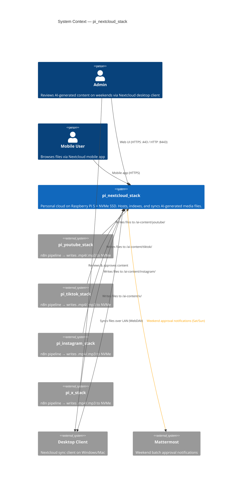
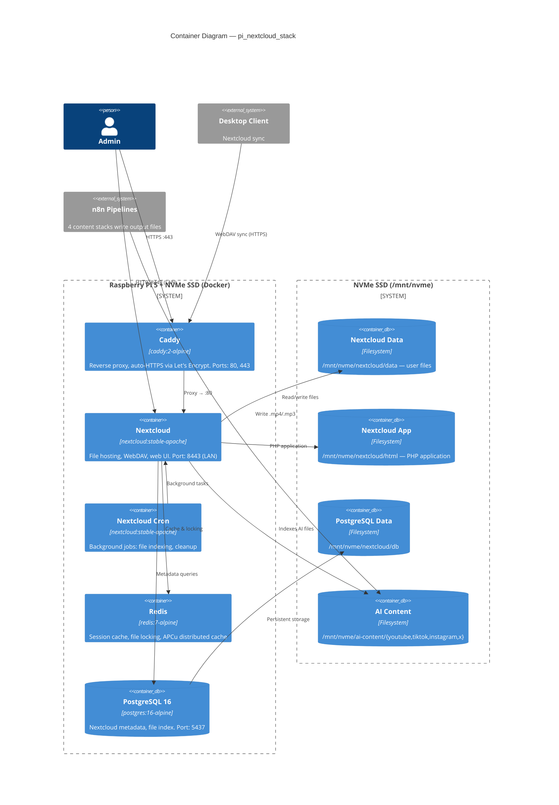
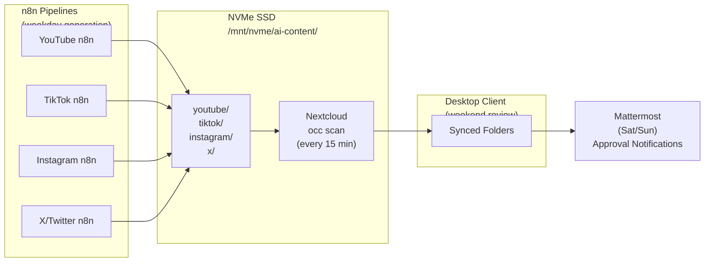

# pi_nextcloud_stack

Personal cloud storage on Raspberry Pi 5 with a 1TB NVMe SSD. Deploys **Nextcloud** (file hosting + sync), **PostgreSQL** (metadata), **Redis** (PHP caching), and **Caddy** (auto-HTTPS reverse proxy) via Docker Compose. All heavy I/O is mapped to the NVMe drive.

Designed to receive `.mp4` and `.mp3` files generated by the n8n content pipelines, index them automatically, and sync them to a desktop client for weekend review.

## Architecture

### C4 Context Diagram



### C4 Container Diagram



### File Flow: n8n → NVMe → Nextcloud → Desktop



## Prerequisites

| Requirement     | Version           | Notes                                     |
| --------------- | ----------------- | ----------------------------------------- |
| Raspberry Pi 5  | ARM64             | 4 GB+ RAM recommended                     |
| Raspberry Pi OS | Bookworm (64-bit) | Or any Debian-based ARM64 distro          |
| Docker          | 24.0+             | `curl -fsSL https://get.docker.com \| sh` |
| Docker Compose  | v2.20+            | `sudo apt install docker-compose-plugin`  |
| NVMe SSD        | 1 TB              | Mounted (e.g., `/mnt/nvme`)               |
| Domain Name     | —                 | Required for external HTTPS access        |

### NVMe SSD Setup

If your NVMe is not yet mounted:

```bash
# 1. Identify the NVMe device
sudo fdisk -l
# Look for /dev/nvme0n1 or /dev/nvme0n1p1

# 2. Format (ONLY if new / unformatted — this erases data!)
sudo mkfs.ext4 /dev/nvme0n1p1

# 3. Create mount point
sudo mkdir -p /mnt/nvme

# 4. Mount
sudo mount /dev/nvme0n1p1 /mnt/nvme

# 5. Auto-mount on boot (add to /etc/fstab)
echo '/dev/nvme0n1p1 /mnt/nvme ext4 defaults,noatime 0 2' | sudo tee -a /etc/fstab

# 6. Verify
df -h /mnt/nvme
```

## Quick Start

```bash
# 1. Clone & enter
git clone https://github.com/Adamo-97/pi_setup.git
cd pi_setup/pi_nextcloud_stack

# 2. Edit environment (set passwords, NVMe path, domain)
cp .env.example .env
nano .env

# 3. Run setup
chmod +x scripts/setup.sh scripts/fix-permissions.sh scripts/scan-files.sh
./scripts/setup.sh

# 4. Access Nextcloud
#    LAN:      http://<pi-ip>:8443
#    External: https://cloud.yourdomain.com  (after DNS + port forwarding)
```

## Folder Structure

```
pi_nextcloud_stack/
├── docker-compose.yml              # Nextcloud + PostgreSQL + Redis + Caddy
├── .env.example                    # Environment variable template
├── .gitignore
├── caddy/
│   └── Caddyfile                   # Reverse proxy + auto-HTTPS config
├── config/
│   └── php-tuning.ini              # PHP OPcache, memory, upload limits
├── scripts/
│   ├── setup.sh                    # One-time installer (11 steps)
│   ├── fix-permissions.sh          # Fix www-data ownership on ai-content
│   └── scan-files.sh              # Force Nextcloud to index new files
└── README.md                       # This file

NVMe SSD Layout (/mnt/nvme):
├── nextcloud/
│   ├── html/                       # Nextcloud PHP application
│   ├── data/                       # User files + admin data
│   └── db/                         # PostgreSQL data directory
└── ai-content/                     # Shared with n8n pipelines
    ├── youtube/                    # .mp4/.mp3 from YouTube pipeline
    ├── tiktok/                     # .mp4/.mp3 from TikTok pipeline
    ├── instagram/                  # .mp4/.mp3 from Instagram pipeline
    └── x/                          # .mp4/.mp3 from X/Twitter pipeline
```

## Configuration

### Environment Variables (`.env`)

| Variable                   | Default             | Description                                 |
| -------------------------- | ------------------- | ------------------------------------------- |
| `NVME_MOUNT`               | `/mnt/nvme`         | NVMe SSD mount point                        |
| `TZ`                       | `Asia/Riyadh`       | Timezone                                    |
| `POSTGRES_DB`              | `nextcloud`         | Database name                               |
| `POSTGRES_USER`            | `nc_user`           | Database user                               |
| `POSTGRES_PASSWORD`        | —                   | Database password (**change this!**)        |
| `POSTGRES_PORT`            | `5437`              | Host port for PostgreSQL                    |
| `NEXTCLOUD_ADMIN_USER`     | `admin`             | Nextcloud admin username                    |
| `NEXTCLOUD_ADMIN_PASSWORD` | —                   | Nextcloud admin password (**change this!**) |
| `NEXTCLOUD_PORT`           | `8443`              | Host port for direct LAN access             |
| `NEXTCLOUD_DOMAIN`         | `cloud.example.com` | Domain for Caddy auto-HTTPS                 |
| `CADDY_HTTP_PORT`          | `80`                | Caddy HTTP (redirects to HTTPS)             |
| `CADDY_HTTPS_PORT`         | `443`               | Caddy HTTPS                                 |
| `HOST_IP`                  | `192.168.1.100`     | Raspberry Pi static IP                      |
| `MATTERMOST_URL`           | —                   | Mattermost server URL                       |
| `MATTERMOST_BOT_TOKEN`     | —                   | Bot Personal Access Token for notifications |
| `MATTERMOST_CHANNEL_ID`    | —                   | Target channel ID for notifications         |

### PHP Performance Tuning

The [config/php-tuning.ini](config/php-tuning.ini) file is mounted into the Nextcloud container and configures:

| Setting                      | Value | Why                                                      |
| ---------------------------- | ----- | -------------------------------------------------------- |
| `memory_limit`               | 512M  | Pi 5 has 4-8 GB RAM; Nextcloud needs headroom            |
| `upload_max_filesize`        | 16G   | Large .mp4 video files                                   |
| `opcache.jit`                | 1255  | JIT compilation for PHP 8.x — major speed boost on ARM64 |
| `opcache.memory_consumption` | 128M  | Cache compiled PHP in memory                             |
| `apc.shm_size`               | 64M   | APCu user cache for Nextcloud metadata                   |

### External Access Setup

To access Nextcloud from outside your LAN:

1. **Domain:** Point a DNS A record to your public IP
2. **Router:** Forward ports 80 and 443 to the Pi's local IP
3. **`.env`:** Set `NEXTCLOUD_DOMAIN=cloud.yourdomain.com`
4. **Restart:** `docker compose restart caddy_nextcloud`
5. **Caddy** automatically obtains a Let's Encrypt certificate

### Desktop Client Sync

1. Download the Nextcloud desktop client: [nextcloud.com/install](https://nextcloud.com/install/#install-clients)
2. **Server URL:**
   - LAN: `http://192.168.1.100:8443`
   - External: `https://cloud.yourdomain.com`
3. Log in with your admin credentials
4. **Selective sync:** Choose the `ai-content` folder to sync only AI-generated files
5. Files appear in your local Nextcloud folder, organized by platform

## n8n Pipeline Integration

### How Files Flow

1. **Weekday (Mon–Fri):** n8n pipelines generate `.mp4`/`.mp3` files and write them to the NVMe:

   ```
   /mnt/nvme/ai-content/youtube/  ← YouTube pipeline output
   /mnt/nvme/ai-content/tiktok/   ← TikTok pipeline output
   /mnt/nvme/ai-content/instagram/ ← Instagram pipeline output
   /mnt/nvme/ai-content/x/        ← X/Twitter pipeline output
   ```

2. **Every 15 minutes:** The `scan-files.sh` cron job:
   - Fixes file permissions (sets `www-data` ownership)
   - Runs `occ files:scan` so Nextcloud recognizes new files

3. **Background sync:** Nextcloud desktop client on your PC picks up new files automatically

4. **Weekend (Sat/Sun):** Mattermost approval notifications fire — you review synced files on your PC and plan the publishing schedule

### Configuring n8n Output Paths

Each n8n stack needs its output directory mapped to the shared NVMe location. Add this volume to each stack's `docker-compose.yml`:

```yaml
# In pi_youtube_stack/docker-compose.yml → n8n_youtube service:
volumes:
  - /mnt/nvme/ai-content/youtube:/home/node/youtube_stack/output:rw

# In pi_tiktok_stack/docker-compose.yml → n8n_tiktok service:
volumes:
  - /mnt/nvme/ai-content/tiktok:/home/node/tiktok_stack/output:rw

# In pi_instagram_stack/docker-compose.yml → n8n_instagram service:
volumes:
  - /mnt/nvme/ai-content/instagram:/home/node/instagram_stack/output:rw

# In pi_x_stack/docker-compose.yml → n8n_x service:
volumes:
  - /mnt/nvme/ai-content/x:/home/node/x_stack/output:rw
```

After adding the volume mounts, restart each stack:

```bash
cd ../pi_youtube_stack && docker compose up -d
cd ../pi_tiktok_stack && docker compose up -d
cd ../pi_instagram_stack && docker compose up -d
cd ../pi_x_stack && docker compose up -d
```

## Permission Management

### The Permission Problem

n8n containers write files as their internal user (typically `root` or UID 1000). Nextcloud runs as `www-data` (UID 33). Without fixing permissions, Nextcloud can't read the n8n output files.

### Fix Permissions Manually

```bash
./scripts/fix-permissions.sh
```

This sets:

- Ownership: `www-data:www-data` (33:33)
- Directories: `2775` (setgid — new files inherit group)
- Files: `664` (owner + group read/write)

### Fix Permissions Automatically

The `scan-files.sh` cron (every 15 min) automatically fixes permissions before scanning. No manual intervention needed for normal operation.

### Force a Full Rescan

```bash
# Scan only ai-content
docker exec -u www-data nextcloud php occ files:scan --path="/admin/files/ai-content"

# Scan everything (slower)
docker exec -u www-data nextcloud php occ files:scan --all
```

## Maintenance

### Useful Commands

```bash
# View live logs
docker compose logs -f nextcloud
docker compose logs -f caddy_nextcloud

# Restart all services
docker compose restart

# Stop everything
docker compose down

# Update all images
docker compose pull && docker compose up -d

# Check container status
docker compose ps

# Nextcloud occ CLI
docker exec -u www-data nextcloud php occ status
docker exec -u www-data nextcloud php occ app:list
docker exec -u www-data nextcloud php occ maintenance:repair

# Redis stats
docker exec redis_nextcloud redis-cli info memory

# PostgreSQL backup
docker exec postgres_nextcloud pg_dump -U nc_user nextcloud > backup.sql

# Check NVMe usage
df -h /mnt/nvme
du -sh /mnt/nvme/nextcloud/data
du -sh /mnt/nvme/ai-content/*
```

### Updating Nextcloud

```bash
# Pull latest images
docker compose pull

# Recreate containers
docker compose up -d

# Run upgrade if needed
docker exec -u www-data nextcloud php occ upgrade
docker exec -u www-data nextcloud php occ maintenance:repair
```

## Ports

| Port | Protocol | Service    | Description                 |
| ---- | -------- | ---------- | --------------------------- |
| 80   | TCP      | Caddy      | HTTP → HTTPS redirect       |
| 443  | TCP      | Caddy      | HTTPS (auto Let's Encrypt)  |
| 8443 | TCP      | Nextcloud  | Direct LAN access (no SSL)  |
| 5437 | TCP      | PostgreSQL | Nextcloud metadata database |

## Coexistence with Other Stacks

| Stack                  | Ports                   | Network             |
| ---------------------- | ----------------------- | ------------------- |
| pi_youtube_stack       | 5433, 5678              | youtube_stack_net   |
| pi_tiktok_stack        | 5434, 5679              | tiktok_stack_net    |
| pi_instagram_stack     | 5435, 5680              | instagram_stack_net |
| pi_x_stack             | 5436, 5681              | x_stack_net         |
| pi_hole_stack          | 53, 8080                | pihole_net          |
| pi_command_center      | 3001, 3010              | command_center_net  |
| **pi_nextcloud_stack** | **80, 443, 5437, 8443** | **nextcloud_net**   |

## Troubleshooting

### Nextcloud stuck on "Initializing..."

```bash
# First startup takes 2-3 minutes on Pi 5. Check logs:
docker compose logs -f nextcloud

# If it keeps restarting:
docker compose down
docker compose up -d
```

### "Access denied" on ai-content files

```bash
# Fix permissions
./scripts/fix-permissions.sh

# Then force scan
./scripts/scan-files.sh
```

### Caddy won't get SSL certificate

```bash
# Check Caddy logs
docker compose logs caddy_nextcloud

# Common issues:
# 1. Domain DNS not pointing to your public IP
# 2. Ports 80/443 not forwarded on your router
# 3. ISP blocking port 80 (try CADDY_HTTP_PORT=8080 in .env)

# For local-only use, just use http://<pi-ip>:8443 directly
```

### "Database connection refused"

```bash
# Check PostgreSQL
docker compose logs postgres_nextcloud
docker exec postgres_nextcloud pg_isready -U nc_user -d nextcloud

# If NVMe isn't mounted, the DB directory is on the SD card:
mountpoint /mnt/nvme && echo "NVMe OK" || echo "NVMe NOT MOUNTED"
```

### Slow performance

```bash
# Verify Redis is connected
docker exec -u www-data nextcloud php occ config:system:get memcache.distributed
# Should output: \OC\Memcache\Redis

# Check PHP OPcache
docker exec nextcloud php -i | grep opcache.enable
# Should output: opcache.enable => On

# Check available memory
docker stats --no-stream nextcloud redis_nextcloud postgres_nextcloud
```

### Desktop client can't connect

- **LAN:** Use `http://<pi-ip>:8443` (not HTTPS)
- **External:** Use `https://cloud.yourdomain.com`
- Ensure `NEXTCLOUD_TRUSTED_DOMAINS` in docker-compose.yml includes your access URL
- Check: `docker exec -u www-data nextcloud php occ config:system:get trusted_domains`

## License

Private — Adamo-97
