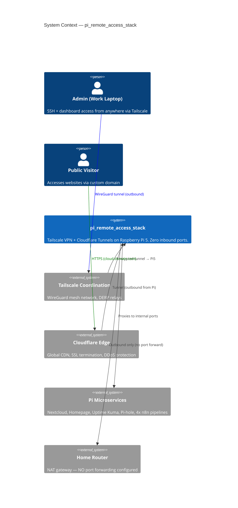
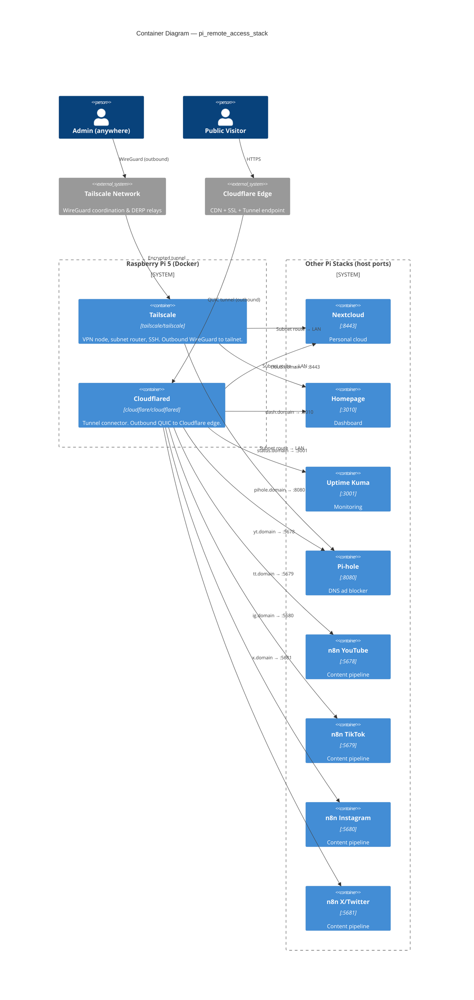
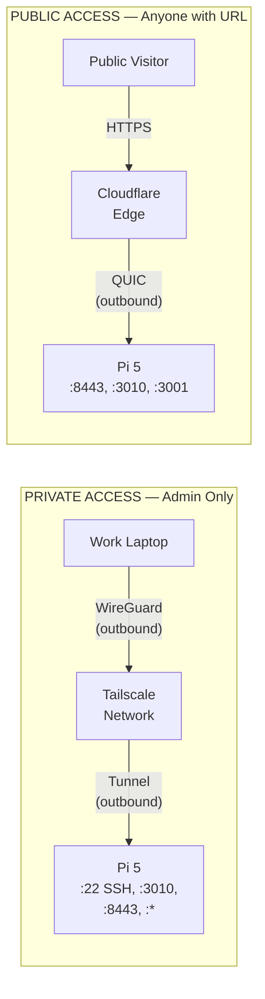

# pi_remote_access_stack

Zero-Trust secure remote access for the Raspberry Pi 5. Deploys **Tailscale** (private VPN + subnet router + SSH) and **Cloudflared** (Cloudflare Tunnels for public web exposure) via Docker Compose. **Zero inbound ports** are opened on the home router — all connections are encrypted outbound tunnels.

## Architecture

### C4 Context Diagram



### C4 Container Diagram



### Traffic Flow



> **Zero-Trust Model:** Home router has 0 ports forwarded. All tunnels are outbound from Pi → encrypted → relay → client.

## Prerequisites

| Requirement        | Version           | Notes                                              |
| ------------------ | ----------------- | -------------------------------------------------- |
| Raspberry Pi 5     | ARM64             | 4 GB+ RAM                                          |
| Raspberry Pi OS    | Bookworm (64-bit) | Or any Debian-based ARM64 distro                   |
| Docker             | 24.0+             | `curl -fsSL https://get.docker.com \| sh`          |
| Docker Compose     | v2.20+            | `sudo apt install docker-compose-plugin`           |
| Tailscale Account  | Free tier         | [login.tailscale.com](https://login.tailscale.com) |
| Cloudflare Account | Free tier         | [dash.cloudflare.com](https://dash.cloudflare.com) |
| Domain Name        | —                 | Managed by Cloudflare DNS                          |

## Quick Start

```bash
# 1. Clone & enter
git clone https://github.com/Adamo-97/pi_setup.git
cd pi_setup/pi_remote_access_stack

# 2. Get your auth credentials (see sections below)

# 3. Configure environment
cp .env.example .env
nano .env
# → Set TAILSCALE_AUTHKEY
# → Set CLOUDFLARE_TUNNEL_TOKEN
# → Set CLOUDFLARE_DOMAIN

# 4. Run setup
chmod +x scripts/*.sh
./scripts/setup.sh

# 5. Approve subnet routes in Tailscale admin
# → https://login.tailscale.com/admin/machines

# 6. Test access
tailscale ssh pi5                        # SSH from anywhere
curl https://cloud.yourdomain.com        # Public Nextcloud
```

## Folder Structure

```
pi_remote_access_stack/
├── docker-compose.yml              # Tailscale + Cloudflared containers
├── .env.example                    # Auth keys, domain, subnet config
├── .gitignore
├── cloudflared/
│   └── config.yml                  # Tunnel ingress rules (subdomain → port)
├── scripts/
│   ├── setup.sh                    # One-time installer (10 steps)
│   ├── tailscale-status.sh         # VPN diagnostics & management
│   └── cloudflare-status.sh        # Tunnel diagnostics & endpoint tests
└── README.md                       # This file
```

## Configuration

### Environment Variables (`.env`)

| Variable                  | Default          | Description                                           |
| ------------------------- | ---------------- | ----------------------------------------------------- |
| `TZ`                      | `Asia/Riyadh`    | Timezone                                              |
| `HOST_IP`                 | `192.168.1.100`  | Pi's static LAN IP                                    |
| `LAN_SUBNET`              | `192.168.1.0/24` | Home network subnet for Tailscale routing             |
| `TAILSCALE_AUTHKEY`       | —                | Auth key from Tailscale admin (**required**)          |
| `TAILSCALE_HOSTNAME`      | `pi5`            | How the Pi appears on your tailnet                    |
| `CLOUDFLARE_TUNNEL_TOKEN` | —                | Tunnel token from Cloudflare dashboard (**required**) |
| `CLOUDFLARE_DOMAIN`       | `example.com`    | Your Cloudflare-managed domain                        |

## Tailscale Setup

### 1. Create an Auth Key

1. Go to [login.tailscale.com/admin/settings/keys](https://login.tailscale.com/admin/settings/keys)
2. Click **Generate auth key**
3. Settings:
   - **Reusable:** Yes (so the Pi can reconnect after reboot)
   - **Ephemeral:** No (we want a persistent node)
   - **Pre-approved:** Yes (skip manual approval)
   - **Tags:** `tag:pi` (optional, useful for ACL policies)
   - **Expiry:** 90 days or "No expiry"
4. Copy the key → paste into `.env` as `TAILSCALE_AUTHKEY`

### 2. Approve Subnet Routes

After the container starts, go to:

[login.tailscale.com/admin/machines](https://login.tailscale.com/admin/machines)

1. Find your Pi (hostname: `pi5`)
2. Click the **...** menu → **Edit route settings**
3. Enable the advertised route: `192.168.1.0/24`
4. Save

Now from your work laptop (with Tailscale installed), you can access:

```bash
# SSH directly
tailscale ssh pi5

# Or traditional SSH via Tailnet IP
ssh user@100.x.x.x

# Access any Pi service via the Pi's LAN IP
http://192.168.1.100:3010    # Homepage
http://192.168.1.100:8443    # Nextcloud
http://192.168.1.100:8080    # Pi-hole
```

### 3. Tailscale SSH (Passwordless)

Tailscale SSH eliminates the need for SSH keys or passwords. It uses your Tailscale identity. Enable it in the Tailscale admin:

1. Go to [login.tailscale.com/admin/acls](https://login.tailscale.com/admin/acls)
2. Add this ACL rule:

```json
{
  "ssh": [
    {
      "action": "accept",
      "src": ["autogroup:member"],
      "dst": ["tag:pi"],
      "users": ["autogroup:nonroot", "root"]
    }
  ]
}
```

3. Now SSH from any device on your tailnet:

```bash
tailscale ssh pi5
```

## Cloudflare Tunnel Setup

### 1. Create a Tunnel (Dashboard Method — Recommended)

1. Go to [one.dash.cloudflare.com](https://one.dash.cloudflare.com) → **Networks** → **Tunnels**
2. Click **Create a tunnel**
3. Choose **Cloudflared** as the connector
4. Name: `pi5-tunnel`
5. Copy the **tunnel token** → paste into `.env` as `CLOUDFLARE_TUNNEL_TOKEN`
6. Add public hostnames:

| Subdomain | Domain           | Service                     |
| --------- | ---------------- | --------------------------- |
| `cloud`   | `yourdomain.com` | `http://192.168.1.100:8443` |
| `dash`    | `yourdomain.com` | `http://192.168.1.100:3010` |
| `status`  | `yourdomain.com` | `http://192.168.1.100:3001` |
| `pihole`  | `yourdomain.com` | `http://192.168.1.100:8080` |
| `yt`      | `yourdomain.com` | `http://192.168.1.100:5678` |
| `tt`      | `yourdomain.com` | `http://192.168.1.100:5679` |
| `ig`      | `yourdomain.com` | `http://192.168.1.100:5680` |
| `x`       | `yourdomain.com` | `http://192.168.1.100:5681` |

The dashboard automatically creates the CNAME records.

### 2. Or Create via CLI

```bash
# Install cloudflared locally (on the Pi or any machine)
sudo apt install cloudflared

# Authenticate
cloudflared tunnel login

# Create tunnel
cloudflared tunnel create pi5-tunnel

# Get the token
cloudflared tunnel token pi5-tunnel
# → Paste into .env as CLOUDFLARE_TUNNEL_TOKEN

# Create CNAME records
cloudflared tunnel route dns pi5-tunnel cloud.yourdomain.com
cloudflared tunnel route dns pi5-tunnel dash.yourdomain.com
cloudflared tunnel route dns pi5-tunnel status.yourdomain.com
# ... repeat for each subdomain
```

### 3. Edit Ingress Rules

The tunnel routes subdomains to internal services via [cloudflared/config.yml](cloudflared/config.yml). To add a new service:

```yaml
# Add above the catch-all rule at the bottom:
- hostname: newservice.yourdomain.com
  service: http://host.docker.internal:PORT
  originRequest:
    connectTimeout: 10s
```

Then restart: `docker compose restart cloudflared`

## Cloudflare Access (Optional — Extra Security)

For sensitive dashboards (n8n, Pi-hole admin), add Cloudflare Access policies:

1. Go to [one.dash.cloudflare.com](https://one.dash.cloudflare.com) → **Access** → **Applications**
2. Click **Add an application** → **Self-hosted**
3. Set the domain (e.g., `pihole.yourdomain.com`)
4. Add a policy:
   - **Allow** → Email matches `your@email.com`
   - Or: One-time PIN sent to your email
5. Save

This adds a login wall before the service, even though the tunnel is already encrypted.

## Diagnostics

### Tailscale

```bash
# Full status report
./scripts/tailscale-status.sh

# Re-authenticate with a new key
./scripts/tailscale-status.sh reauth

# Temporarily disconnect
./scripts/tailscale-status.sh down

# Reconnect
./scripts/tailscale-status.sh up

# Raw status from container
docker exec tailscale tailscale status
docker exec tailscale tailscale ping pi5
docker exec tailscale tailscale netcheck
```

### Cloudflare Tunnel

```bash
# Full status + endpoint tests
./scripts/cloudflare-status.sh

# Test all public endpoints
./scripts/cloudflare-status.sh test

# Tail logs
./scripts/cloudflare-status.sh logs

# Raw logs from container
docker compose logs -f cloudflared
```

## Maintenance

### Useful Commands

```bash
# View live logs
docker compose logs -f

# Restart both services
docker compose restart

# Stop everything
docker compose down

# Update images
docker compose pull && docker compose up -d

# Container status
docker compose ps

# Tailscale node info
docker exec tailscale tailscale whois $(docker exec tailscale tailscale ip -4)

# Check tunnel metrics
docker exec cloudflared wget -qO- http://localhost:2000/metrics | head -20
```

### Rotating Tailscale Auth Key

Auth keys expire (unless set to "no expiry"). To rotate:

1. Generate a new key at [login.tailscale.com/admin/settings/keys](https://login.tailscale.com/admin/settings/keys)
2. Update `.env`:
   ```
   TAILSCALE_AUTHKEY=tskey-auth-NEW_KEY_HERE
   ```
3. Re-authenticate: `./scripts/tailscale-status.sh reauth`

### Rotating Cloudflare Tunnel Token

1. Go to [one.dash.cloudflare.com](https://one.dash.cloudflare.com) → **Tunnels** → your tunnel
2. Click **Configure** → **Token** → regenerate
3. Update `.env`:
   ```
   CLOUDFLARE_TUNNEL_TOKEN=new_token_here
   ```
4. Restart: `docker compose restart cloudflared`

## Ports

**This stack opens ZERO host ports.** Both Tailscale and Cloudflared establish outbound-only encrypted tunnels.

| Service     | Protocol              | Direction    | Description          |
| ----------- | --------------------- | ------------ | -------------------- |
| Tailscale   | WireGuard (UDP 41641) | **Outbound** | Encrypted VPN tunnel |
| Cloudflared | QUIC (UDP 7844)       | **Outbound** | Encrypted web tunnel |

## Coexistence with Other Stacks

| Stack                      | Ports               | Network               | Access via Tailscale | Access via Cloudflare  |
| -------------------------- | ------------------- | --------------------- | -------------------- | ---------------------- |
| pi_youtube_stack           | 5433, 5678          | youtube_stack_net     | ✅ subnet route      | yt.domain.com          |
| pi_tiktok_stack            | 5434, 5679          | tiktok_stack_net      | ✅ subnet route      | tt.domain.com          |
| pi_instagram_stack         | 5435, 5680          | instagram_stack_net   | ✅ subnet route      | ig.domain.com          |
| pi_x_stack                 | 5436, 5681          | x_stack_net           | ✅ subnet route      | x.domain.com           |
| pi_hole_stack              | 53, 8080            | pihole_net            | ✅ subnet route      | pihole.domain.com      |
| pi_command_center          | 3001, 3010          | command_center_net    | ✅ subnet route      | dash/status.domain.com |
| pi_nextcloud_stack         | 80, 443, 5437, 8443 | nextcloud_net         | ✅ subnet route      | cloud.domain.com       |
| **pi_remote_access_stack** | **none**            | **remote_access_net** | —                    | —                      |

## Security Considerations

### What's Protected

- **No SSH port exposed**: SSH only via Tailscale (identity-based, no passwords)
- **No web ports forwarded**: Public access only through Cloudflare Tunnels (DDoS protected, WAF eligible)
- **Encrypted in transit**: WireGuard (Tailscale) + QUIC/TLS (Cloudflare) — both AES-256
- **State persisted**: Node identity survives reboots (Docker volumes)

### Recommendations

1. **Enable Tailscale MFA**: Settings → Multi-factor Auth in the Tailscale admin
2. **Use Cloudflare Access**: Add email-based auth for sensitive dashboards (Pi-hole, n8n)
3. **Set ACL policies**: Restrict which Tailscale users can access which services
4. **Rotate keys**: Set calendar reminders for auth key expiry dates
5. **Monitor access**: Check Tailscale admin logs and Cloudflare analytics regularly

## Troubleshooting

### Tailscale won't connect

```bash
# Check container logs
docker compose logs tailscale

# Common issues:
# 1. Auth key expired → generate a new one & reauth
# 2. /dev/net/tun missing → sudo mknod /dev/net/tun c 10 200
# 3. IP forwarding disabled → sudo sysctl -w net.ipv4.ip_forward=1
```

### Subnet routes not working

```bash
# Verify routes are advertised
docker exec tailscale tailscale status

# Check if routes are approved
# → login.tailscale.com/admin/machines → pi5 → Edit route settings

# Ensure IP forwarding is enabled on the host
sysctl net.ipv4.ip_forward
# Must output: net.ipv4.ip_forward = 1
```

### Cloudflare tunnel shows "connection refused"

```bash
# Check the internal service is actually running
curl http://192.168.1.100:8443    # Nextcloud
curl http://192.168.1.100:3010    # Homepage

# Verify cloudflared can reach the host
docker exec cloudflared wget -qO- http://host.docker.internal:3010

# Check config.yml for typos
cat cloudflared/config.yml
```

### "DNS resolution failed" for subdomains

```bash
# Verify CNAME records exist in Cloudflare DNS
dig cloud.yourdomain.com +short
# Should return: <tunnel-id>.cfargotunnel.com

# If using dashboard tunnel: hostnames are auto-created
# If using CLI tunnel: run cloudflared tunnel route dns pi5-tunnel cloud.yourdomain.com
```

## License

Private — Adamo-97
