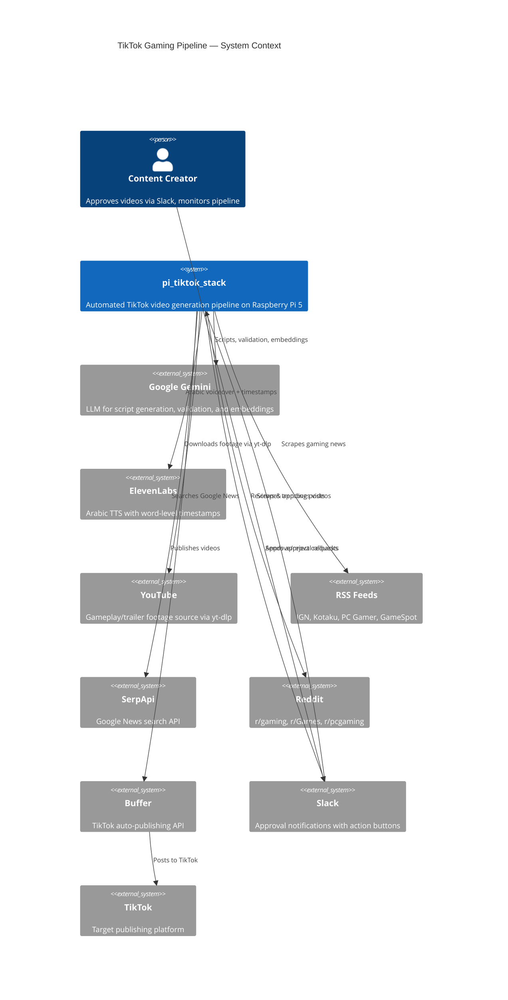
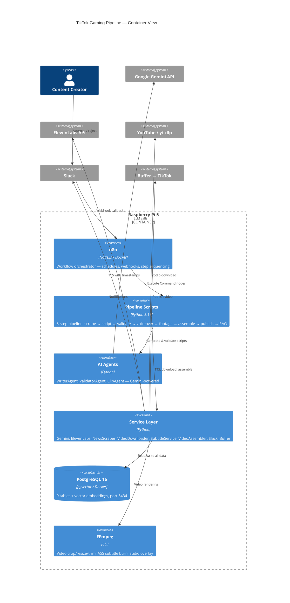

# 🎬 pi_tiktok_stack

Fully automated TikTok gaming content pipeline for Raspberry Pi 5. Scrapes trending gaming news, generates Arabic scripts with AI, produces voiceover with word-level timestamps, downloads gameplay footage, assembles vertical 9:16 videos with burnt-in word-by-word Arabic subtitles, and publishes to TikTok via Buffer — all orchestrated by n8n.

---

## Architecture

### C4 Context Diagram



### C4 Container Diagram



---

## Pipeline Flow

```
┌─────────────┐    ┌─────────────┐    ┌─────────────┐    ┌─────────────┐
│  Step 1      │    │  Step 2      │    │  Step 3      │    │  Step 4      │
│  Scrape News │───▶│  Generate    │───▶│  Validate    │───▶│  Generate    │
│  RSS/Google/ │    │  Script      │    │  Script      │    │  Voiceover   │
│  Reddit      │    │  (Gemini)    │    │  (AI Gate)   │    │  (ElevenLabs)│
└─────────────┘    └─────────────┘    └──────┬───────┘    └─────────────┘
                                             │ ❌ Reject                    │
                                             │ → Auto-revise (2x)          ▼
┌─────────────┐    ┌─────────────┐    ┌─────────────┐    ┌─────────────┐
│  Step 8      │    │  Step 7      │    │  Step 6      │    │  Step 5      │
│  Update RAG  │◀───│  Publish     │◀───│  Assemble    │◀───│  Download    │
│  (Embeddings)│    │  (Buffer →   │    │  Video       │    │  Footage     │
│              │    │   TikTok)    │    │  (FFmpeg)    │    │  (yt-dlp)    │
└─────────────┘    └──────┬───────┘    └─────────────┘    └─────────────┘
                          │
                   ┌──────┴───────┐
                   │  Slack       │
                   │  Approval    │
                   │  ✅ / ❌     │
                   └──────────────┘
```

---

## Prerequisites

### System Requirements

- **Raspberry Pi 5** (4GB+ RAM recommended)
- **Raspberry Pi OS** (64-bit / Bookworm)
- **Storage**: 10GB+ free for videos and footage

### Software

```bash
# Docker & Docker Compose
curl -fsSL https://get.docker.com | sh
sudo usermod -aG docker $USER
sudo apt-get install -y docker-compose-plugin

# FFmpeg (required for video assembly)
sudo apt-get install -y ffmpeg

# Python 3.11+
sudo apt-get install -y python3 python3-pip python3-venv

# Arabic fonts
sudo apt-get install -y fonts-dejavu-core fonts-noto fonts-arabeyes
```

### API Keys Required

| Service                  | Key                                          | Purpose                                   |
| ------------------------ | -------------------------------------------- | ----------------------------------------- |
| **Google Gemini**        | `GEMINI_API_KEY`                             | Script generation, validation, embeddings |
| **ElevenLabs**           | `ELEVENLABS_API_KEY` + `ELEVENLABS_VOICE_ID` | Arabic TTS with word timestamps           |
| **Slack**                | `SLACK_WEBHOOK_URL`                          | Approval notifications                    |
| **Buffer**               | `BUFFER_ACCESS_TOKEN` + `BUFFER_PROFILE_ID`  | TikTok publishing                         |
| **SerpApi** _(optional)_ | `SERPAPI_KEY`                                | Google News search                        |

---

## Quick Start

### Option 1: Automated Setup

```bash
git clone <repo-url> pi_tiktok_stack
cd pi_tiktok_stack
chmod +x setup.sh
./setup.sh
```

### Option 2: Manual Setup

```bash
cd pi_tiktok_stack

# 1. Environment
cp .env.example .env
nano .env  # Add your API keys

# 2. Python
python3 -m venv venv
source venv/bin/activate
pip install -r requirements.txt

# 3. Directories
mkdir -p output/{videos,voiceovers,scripts,subtitles,temp} footage

# 4. Docker services
docker compose up -d

# 5. Import n8n workflow
# Open http://<pi-ip>:5679
# Import → n8n_workflow.json
```

### Option 3: Docker Only

```bash
cp .env.example .env && nano .env
docker compose up -d
```

---

## Project Structure

```
pi_tiktok_stack/
├── config/
│   ├── __init__.py
│   ├── settings.py              # Centralized configuration (dataclasses)
│   └── prompts/
│       ├── __init__.py
│       ├── writer_prompts.py    # Arabic TikTok script templates
│       └── validator_prompts.py # 7-criteria quality gate prompts
├── database/
│   ├── __init__.py
│   ├── init.sql                 # 9 tables + pgvector extension
│   ├── connection.py            # ThreadedConnectionPool
│   ├── models.py                # Pydantic v2 data models
│   └── rag_manager.py           # RAG embeddings + feedback
├── services/
│   ├── __init__.py
│   ├── gemini_service.py        # Gemini text/JSON/embeddings
│   ├── elevenlabs_service.py    # TTS + word-level timestamps
│   ├── embedding_service.py     # Embedding helper wrapper
│   ├── news_scraper.py          # RSS + Google News + Reddit
│   ├── video_downloader.py      # yt-dlp + local fallback
│   ├── subtitle_service.py      # ASS subtitle generation (word-by-word)
│   ├── video_assembler.py       # FFmpeg vertical video assembly
│   ├── slack_service.py         # Block Kit approval messages
│   └── buffer_service.py        # Buffer API → TikTok publishing
├── agents/
│   ├── __init__.py
│   ├── base_agent.py            # Abstract base with RAG helpers
│   ├── writer_agent.py          # Arabic script generation
│   ├── validator_agent.py       # 7-criteria quality validation
│   └── clip_agent.py            # AI footage selection
├── pipeline/
│   ├── __init__.py
│   ├── step1_scrape_news.py     # Scrape RSS/Google/Reddit
│   ├── step2_generate_script.py # Generate Arabic TikTok script
│   ├── step3_validate_script.py # AI quality gate + auto-revision
│   ├── step4_generate_voiceover.py # ElevenLabs TTS + timestamps
│   ├── step5_download_footage.py   # yt-dlp gameplay download
│   ├── step6_assemble_video.py     # FFmpeg 9:16 video assembly
│   ├── step7_publish_tiktok.py     # Slack notify / Buffer publish
│   └── step8_update_rag.py         # RAG memory update
├── footage/                     # Local footage library (.gitkeep)
├── output/                      # Generated videos, voiceovers, subtitles
├── docker-compose.yml           # PostgreSQL (5434) + n8n (5679)
├── n8n_workflow.json            # Complete n8n workflow
├── requirements.txt             # Python dependencies
├── setup.sh                     # One-click setup script
├── .env.example                 # Environment template
├── .gitignore
└── README.md
```

---

## Docker Services

| Service           | Image                    | Port   | Purpose                      |
| ----------------- | ------------------------ | ------ | ---------------------------- |
| `postgres_tiktok` | `pgvector/pgvector:pg16` | `5434` | Database + vector embeddings |
| `n8n_tiktok`      | `n8nio/n8n:latest`       | `5679` | Workflow orchestration       |

Both containers are limited to **512MB RAM** for Pi 5 optimization.

> **Note:** These ports are isolated from `pi_youtube_stack` (5433/5678) so both stacks can run simultaneously.

---

## Database Schema

9 tables in `tiktok_rag` database:

| Table               | Purpose                                               |
| ------------------- | ----------------------------------------------------- |
| `news_articles`     | Scraped news (source, URL, title, summary, used flag) |
| `generated_scripts` | Arabic TikTok scripts with news_ids linkage           |
| `validations`       | 7-criteria scores + approval decision                 |
| `voiceovers`        | ElevenLabs audio + word_timestamps JSONB              |
| `video_footage`     | Downloaded clips (YouTube/local)                      |
| `rendered_videos`   | Final videos + Buffer publish status                  |
| `rag_embeddings`    | 768-dim vectors with HNSW index                       |
| `feedback_log`      | User/auto feedback for RAG context                    |
| `pipeline_runs`     | Execution history and status                          |

---

## Validation Criteria

The ValidatorAgent scores scripts on 7 TikTok-specific criteria (0-100):

| Criterion           | Description                            | Threshold                   |
| ------------------- | -------------------------------------- | --------------------------- |
| `hook_strength`     | First 3 seconds impact                 | **≥60** (auto-reject below) |
| `accuracy`          | Factual correctness vs sources         | —                           |
| `pacing`            | Speaking speed for 30-60s format       | —                           |
| `engagement`        | Viewer retention signals               | —                           |
| `language_quality`  | Arabic fluency and naturalness         | —                           |
| `cta_effectiveness` | Call-to-action strength                | —                           |
| `tiktok_fit`        | Platform optimization (trends, format) | —                           |

**Overall threshold: ≥70** to pass. Failed scripts get up to **2 auto-revisions**.

---

## Subtitle System

TikTok-viral **word-by-word Arabic karaoke** subtitles:

- Gold highlight (`#FFD700`) on the currently spoken word
- White (`#FFFFFF`) for other words in the group
- Semi-transparent black background bar
- ASS subtitle format with centisecond timing
- Positioned at 70% screen height (TikTok safe zone)
- Groups of 4 words per subtitle frame

---

## Content Types

| Type               | Trigger        | Description                  |
| ------------------ | -------------- | ---------------------------- |
| `trending_news`    | Daily 9AM auto | Top 2-3 gaming news stories  |
| `game_spotlight`   | Manual webhook | Deep dive on a single game   |
| `trailer_reaction` | Manual webhook | Commentary over new trailers |

---

## Running Individual Steps

```bash
source venv/bin/activate

# Scrape news
python -m pipeline.step1_scrape_news --source all

# Generate script
python -m pipeline.step2_generate_script --type trending_news --duration 45

# Validate (with auto-revision)
python -m pipeline.step3_validate_script --script-id <UUID>

# Generate voiceover
python -m pipeline.step4_generate_voiceover --script-id <UUID>

# Download footage
python -m pipeline.step5_download_footage --script-id <UUID>

# Assemble video
python -m pipeline.step6_assemble_video \
    --script-id <UUID> \
    --voiceover-id <UUID> \
    --footage-id <UUID>

# Send for approval / publish
python -m pipeline.step7_publish_tiktok --video-id <UUID> --mode notify
python -m pipeline.step7_publish_tiktok --video-id <UUID> --mode publish

# Update RAG
python -m pipeline.step8_update_rag --video-id <UUID>
```

---

## n8n Workflow

Import `n8n_workflow.json` into n8n at `http://<pi-ip>:5679`.

**Triggers:**

- **Schedule**: Daily at 9:00 AM (trending_news)
- **Webhook**: `POST /webhook/tiktok-manual` (manual trigger)
- **Webhook**: `GET /webhook/tiktok-approve` (Slack approve callback)
- **Webhook**: `GET /webhook/tiktok-reject` (Slack reject callback)

---

## Coexistence with pi_youtube_stack

| Resource        | YouTube Stack       | TikTok Stack       |
| --------------- | ------------------- | ------------------ |
| PostgreSQL port | 5433                | **5434**           |
| n8n port        | 5678                | **5679**           |
| Docker network  | `youtube_stack_net` | `tiktok_stack_net` |
| Database name   | `youtube_rag`       | `tiktok_rag`       |
| DB user         | `yt_user`           | `tt_user`          |

Both stacks run independently on the same Pi 5 with no resource conflicts.

---

## License

Private project — not for redistribution.
