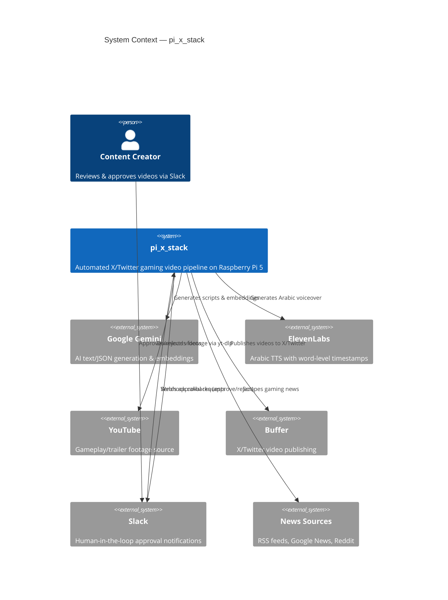
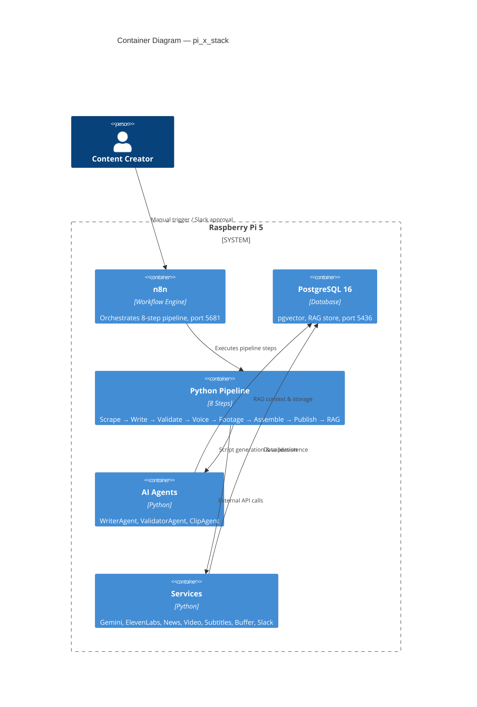

# pi_x_stack

Fully automated X/Twitter gaming video pipeline running on a Raspberry Pi 5. Generates provocative, debate-provoking Arabic gaming content — scrapes news, writes scripts with tweet captions, validates quality, generates voiceover, downloads footage, assembles vertical videos, and publishes via Buffer.

## Architecture

### C4 Context Diagram



### C4 Container Diagram



## Stack Coexistence

All four stacks run independently on the same Raspberry Pi 5:

| Stack              | PostgreSQL | n8n      | Network             | Database      |
| ------------------ | ---------- | -------- | ------------------- | ------------- |
| pi_youtube_stack   | 5433       | 5678     | youtube_stack_net   | youtube_rag   |
| pi_tiktok_stack    | 5434       | 5679     | tiktok_stack_net    | tiktok_rag    |
| pi_instagram_stack | 5435       | 5680     | instagram_stack_net | instagram_rag |
| **pi_x_stack**     | **5436**   | **5681** | **x_stack_net**     | **x_rag**     |

## Pipeline Steps

```
Step 1: Scrape News         — RSS, Google News, Reddit gaming sources
Step 2: Generate Script     — Gemini AI writes provocative Arabic script + tweet caption
Step 3: Validate Script     — 7-criteria quality gate (x_fit, hook_strength, etc.)
Step 4: Generate Voiceover  — ElevenLabs Arabic TTS with word timestamps
Step 5: Download Footage    — yt-dlp YouTube clips + local fallback
Step 6: Assemble Video      — FFmpeg 1080×1920 vertical + ASS karaoke subtitles
Step 7: Publish to X        — Slack approval → Buffer API → X/Twitter
Step 8: Update RAG          — Store embeddings & feedback for future context
```

## Content Types

| Type                 | Description                   | Example                          |
| -------------------- | ----------------------------- | -------------------------------- |
| `trending_news`      | Breaking gaming/hardware news | "PS6 leaked specs"               |
| `game_spotlight`     | Deep-dive on a specific game  | "Why Elden Ring changed RPGs"    |
| `controversial_take` | Provocative industry debate   | "Mobile gaming > console gaming" |
| `trailer_reaction`   | New trailer analysis          | "GTA VI trailer breakdown"       |

## X-Specific Features

- **Tweet Caption**: Auto-generated `<280` char Arabic tweet text via `[تغريدة]` marker
- **x_fit Validation**: Scores provocative, debate-provoking X-native style
- **Controversial Take**: Unique content type for hot takes and unpopular opinions
- **Tone**: مباشر، حاد، يثير النقاش (direct, sharp, debate-provoking)
- **Controversy-focused subreddits**: gamingcirclejerk, truegaming, PatientGamers

## Quick Start

```bash
# 1. Clone & setup
git clone https://github.com/Adamo-97/pi_setup.git
cd pi_setup/pi_x_stack
chmod +x setup.sh && ./setup.sh

# 2. Configure API keys
nano .env

# 3. Start Docker services
docker compose up -d

# 4. Import n8n workflow
# Open http://<pi-ip>:5681 → Import n8n_workflow.json

# 5. Test pipeline
source venv/bin/activate
python -m pipeline.step1_scrape_news
```

## Project Structure

```
pi_x_stack/
├── config/
│   ├── settings.py              # Central configuration
│   └── prompts/
│       ├── writer_prompts.py    # Arabic script generation prompts
│       └── validator_prompts.py # 7-criteria validation prompts
├── database/
│   ├── init.sql                 # PostgreSQL schema + pgvector
│   ├── connection.py            # Connection pool
│   ├── models.py                # Pydantic data models
│   └── rag_manager.py           # RAG embedding store
├── services/
│   ├── gemini_service.py        # Google Gemini API
│   ├── elevenlabs_service.py    # ElevenLabs TTS
│   ├── embedding_service.py     # Text embedding helpers
│   ├── news_scraper.py          # RSS/Google/Reddit scraper
│   ├── video_downloader.py      # yt-dlp + local footage
│   ├── subtitle_service.py      # ASS karaoke subtitles
│   ├── video_assembler.py       # FFmpeg video assembly
│   ├── slack_service.py         # Slack approval webhooks
│   └── buffer_service.py        # Buffer X/Twitter publishing
├── agents/
│   ├── base_agent.py            # Abstract agent base class
│   ├── writer_agent.py          # AI script writer
│   ├── validator_agent.py       # AI quality validator
│   └── clip_agent.py            # AI footage selector
├── pipeline/
│   ├── step1_scrape_news.py
│   ├── step2_generate_script.py
│   ├── step3_validate_script.py
│   ├── step4_generate_voiceover.py
│   ├── step5_download_footage.py
│   ├── step6_assemble_video.py
│   ├── step7_publish_x.py
│   └── step8_update_rag.py
├── footage/                     # Local footage library
├── n8n_workflow.json            # n8n workflow (import to port 5681)
├── docker-compose.yml           # PostgreSQL + n8n
├── requirements.txt
├── setup.sh
├── .env.example
└── .gitignore
```

## Video Specs

| Property   | Value                              |
| ---------- | ---------------------------------- |
| Resolution | 1080 × 1920 (vertical 9:16)        |
| Frame Rate | 30 fps                             |
| Duration   | 30–60 seconds                      |
| Codec      | H.264 (libx264)                    |
| Audio      | AAC, 44100 Hz                      |
| Subtitles  | ASS word-by-word karaoke highlight |

## Environment Variables

See [.env.example](.env.example) for all required keys:

- `GEMINI_API_KEY` — Google Gemini API
- `ELEVENLABS_API_KEY` — ElevenLabs TTS
- `ELEVENLABS_VOICE_ID` — Arabic voice ID
- `SERPAPI_KEY` — Google News scraping
- `BUFFER_ACCESS_TOKEN` — Buffer publishing
- `BUFFER_PROFILE_ID` — X/Twitter Buffer profile
- `SLACK_WEBHOOK_URL` — Slack notifications
- `POSTGRES_*` — Database configuration

## Schedule

- **Automatic**: Daily at 9:00 AM via n8n schedule trigger
- **Manual**: POST to `http://<pi-ip>:5681/webhook/x-manual`

## License

Private — Adamo-97
