# pi_x_stack

Fully automated X/Twitter gaming video pipeline running on a Raspberry Pi 5. Generates provocative, debate-provoking Arabic gaming content — scrapes news, writes scripts with tweet captions, validates quality, generates voiceover, downloads footage, assembles vertical videos, and publishes via Buffer.

## Architecture

### C4 Context Diagram

```mermaid
C4Context
    title System Context — pi_x_stack

    Person(user, "Content Creator", "Reviews & approves videos via Mattermost")

    System(x_stack, "pi_x_stack", "Automated X/Twitter gaming video pipeline on Raspberry Pi 5")

    System_Ext(gemini, "Google Gemini", "AI text/JSON generation & embeddings")
    System_Ext(elevenlabs, "ElevenLabs", "Arabic TTS with word-level timestamps")
    System_Ext(youtube, "YouTube", "Gameplay/trailer footage source")
    System_Ext(buffer, "Buffer", "X/Twitter video publishing")
    System_Ext(mattermost, "Mattermost", "Human-in-the-loop approval notifications")
    System_Ext(news, "News Sources", "RSS feeds, Google News, Reddit")

    Rel(user, mattermost, "Approves/rejects videos")
    Rel(x_stack, gemini, "Generates scripts & embeddings")
    Rel(x_stack, elevenlabs, "Generates Arabic voiceover")
    Rel(x_stack, youtube, "Downloads footage via yt-dlp")
    Rel(x_stack, buffer, "Publishes videos to X/Twitter")
    Rel(x_stack, mattermost, "Sends approval requests")
    Rel(x_stack, news, "Scrapes gaming news")
    Rel(mattermost, x_stack, "Webhook callbacks (approve/reject)")
```



### C4 Container Diagram

```mermaid
C4Container
    title Container Diagram — pi_x_stack

    Person(user, "Content Creator")

    System_Boundary(pi, "Raspberry Pi 5") {
        Container(n8n, "n8n", "Workflow Engine", "Orchestrates 6-gate HITL pipeline, port 5681")
        Container(postgres, "PostgreSQL 16", "Database", "pgvector, RAG store, port 5436")
        Container(redis, "Redis", "Cache", "Rate limiting + budget cache, port 6382")
        Container(pipeline, "Python Pipeline", "8 Steps", "Scrape → Write → Validate → Voice → Footage → Assemble → Publish → RAG")
        Container(agents, "AI Agents", "Python", "PlannerAgent, WriterAgent, ValidatorAgent, ClipAgent")
        Container(services, "Services", "Python", "Gemini, ElevenLabs, News, Video, Subtitles, Buffer, Mattermost, RateLimiter, BudgetReader")
    }

    Rel(user, n8n, "Manual trigger / Mattermost approval")
    Rel(n8n, pipeline, "Executes pipeline steps")
    Rel(pipeline, agents, "Script generation & validation")
    Rel(pipeline, services, "External API calls")
    Rel(agents, postgres, "RAG context & storage")
    Rel(services, postgres, "Data persistence")
```



## Stack Coexistence

All four stacks run independently on the same Raspberry Pi 5:

| Stack              | PostgreSQL | n8n      | Redis    | Network             | Database      |
| ------------------ | ---------- | -------- | -------- | ------------------- | ------------- |
| pi_youtube_stack   | 5433       | 5678     | 6379     | youtube_stack_net   | youtube_rag   |
| pi_tiktok_stack    | 5434       | 5679     | 6380     | tiktok_stack_net    | tiktok_rag    |
| pi_instagram_stack | 5435       | 5680     | 6381     | instagram_stack_net | instagram_rag |
| **pi_x_stack**     | **5436**   | **5681** | **6382** | **x_stack_net**     | **x_rag**     |

## Pipeline Steps (6-Gate Human-in-the-Loop)

Every phase requires **explicit human approval** via Mattermost before proceeding. Nothing proceeds past any gate without your click.

```mermaid
flowchart TD
    START([🕐 Daily 11AM / Manual]) --> BUDGET[📊 Load budgets.json]
    BUDGET --> PLAN[🧠 X Planner — RAWG + Breaking News]

    PLAN --> GATE0{🔔 Gate 0 — Plan Review}
    GATE0 -- ✅ Approve --> SCRAPE[📰 Scrape News]
    GATE0 -- ❌ Reject --> R0[Reject + RAG]

    SCRAPE --> GATE1{🔔 Gate 1 — Data Review}
    GATE1 -- ✅ Approve --> SCRIPT[✍️ Writer Agent — X Thread Script]
    GATE1 -- ❌ Reject --> R1[Reject]

    SCRIPT --> VALIDATE[🔍 Validator Agent]
    VALIDATE --> GATE2{🔔 Gate 2 — Script Review}
    GATE2 -- ✅ Approve --> VOICE[🎙️ ElevenLabs TTS]
    GATE2 -- ❌ Reject --> R2[Reject]

    VOICE --> GATE3{🔔 Gate 3 — Audio Review}
    GATE3 -- ✅ Approve --> FOOTAGE[📹 Download + Assemble]
    GATE3 -- ❌ Reject --> R3[Reject]

    FOOTAGE --> GATE4{🔔 Gate 4 — Video Review}
    GATE4 -- ✅ Approve --> PUBLISH{🔔 Gate 5 — Final Publish + 📎 Thumbnail Upload}
    GATE4 -- ❌ Reject --> R4[Reject]

    PUBLISH -- ✅ + 🖼️ Thumbnail --> BUFFER[📤 Buffer → X]
    BUFFER --> RAG[🧠 Update RAG]
    PUBLISH -- ❌ --> R5[Reject]

    SCRIPT -.-> REDIS[🔴 Redis Rate Limiter]
    VOICE -.-> REDIS
    FOOTAGE -.-> REDIS
    PLAN -.-> REDIS

    style GATE0 fill:#2196F3,color:#fff
    style GATE1 fill:#2196F3,color:#fff
    style GATE2 fill:#2196F3,color:#fff
    style GATE3 fill:#2196F3,color:#fff
    style GATE4 fill:#2196F3,color:#fff
    style PUBLISH fill:#FF9800,color:#fff
    style REDIS fill:#f44336,color:#fff
```



### Approval Gates Summary

| Gate       | Phase   | What You Review                                                  |
| ---------- | ------- | ---------------------------------------------------------------- |
| **Gate 0** | Plan    | Planner Agent's content plan (game, hot take angle)              |
| **Gate 1** | Data    | Scraped news articles (relevance, controversy level)             |
| **Gate 2** | Script  | AI-generated Arabic script + tweet caption + validation scores   |
| **Gate 3** | Audio   | ElevenLabs voiceover + word timestamps                           |
| **Gate 4** | Video   | Assembled 9:16 video with subtitles                              |
| **Gate 5** | Publish | Final review + **manual thumbnail upload** via Mattermost thread |

## Content Types

| Type                 | Description                   | Example                          |
| -------------------- | ----------------------------- | -------------------------------- |
| `trending_news`      | Breaking gaming/hardware news | "PS6 leaked specs"               |
| `game_spotlight`     | Deep-dive on a specific game  | "Why Elden Ring changed RPGs"    |
| `controversial_take` | Provocative industry debate   | "Mobile gaming > console gaming" |
| `trailer_reaction`   | New trailer analysis          | "GTA VI trailer breakdown"       |

## X-Specific Features

- **Tweet Caption**: Auto-generated `<280` char Arabic tweet text via `[تغريدة]` marker
- **x_fit Validation**: Scores provocative, debate-provoking X-native style
- **Controversial Take**: Unique content type for hot takes and unpopular opinions
- **Tone**: مباشر، حاد، يثير النقاش (direct, sharp, debate-provoking)
- **Controversy-focused subreddits**: gamingcirclejerk, truegaming, PatientGamers

## Quick Start

```bash
# 1. Clone & setup
git clone https://github.com/Adamo-97/pi_setup.git
cd pi_setup/pi_x_stack
chmod +x setup.sh && ./setup.sh

# 2. Configure API keys
nano .env

# 3. Start Docker services
docker compose up -d

# 4. Import n8n workflow
# Open http://<pi-ip>:5681 → Import n8n_workflow.json

# 5. Test pipeline
source venv/bin/activate
python -m pipeline.step1_scrape_news
```

## Project Structure

```
pi_x_stack/
├── config/
│   ├── settings.py              # Central config + RedisConfig, BudgetConfig, SharedRAWGConfig
│   ├── budgets.json             # Per-platform weekly budget quotas
│   └── prompts/
│       ├── writer_prompts.py    # Arabic script generation prompts
│       └── validator_prompts.py # 7-criteria validation prompts
├── database/
│   ├── init.sql                 # PostgreSQL schema + pgvector
│   ├── connection.py            # Connection pool
│   ├── models.py                # Pydantic data models
│   └── rag_manager.py           # RAG embedding store
├── services/
│   ├── gemini_service.py        # Google Gemini API
│   ├── elevenlabs_service.py    # ElevenLabs TTS
│   ├── embedding_service.py     # Text embedding helpers
│   ├── news_scraper.py          # RSS/Google/Reddit scraper
│   ├── video_downloader.py      # yt-dlp + local footage
│   ├── subtitle_service.py      # ASS karaoke subtitles
│   ├── video_assembler.py       # FFmpeg video assembly
│   ├── mattermost_service.py    # 6-gate HITL approval messages via Mattermost
│   └── buffer_service.py        # Buffer X/Twitter publishing
│   ├── redis_rate_limiter.py    # Redis-backed budget enforcement (7-day TTL)
│   └── budget_reader.py         # Loads budgets.json from Nextcloud/Redis/local
├── agents/
│   ├── base_agent.py            # Abstract agent base class
│   ├── planner_agent.py         # Content planner — RAWG cache + breaking news (Gate 0)
│   ├── writer_agent.py          # AI script writer
│   ├── validator_agent.py       # AI quality validator
│   └── clip_agent.py            # AI footage selector
├── pipeline/
│   ├── step1_scrape_news.py
│   ├── step2_generate_script.py
│   ├── step3_validate_script.py
│   ├── step4_generate_voiceover.py
│   ├── step5_download_footage.py
│   ├── step6_assemble_video.py
│   ├── step7_publish_x.py
│   └── step8_update_rag.py
├── footage/                     # Local footage library
├── n8n_workflow.json            # n8n workflow (import to port 5681)
├── docker-compose.yml           # PostgreSQL + n8n
├── requirements.txt
├── setup.sh
├── .env.example
└── .gitignore
```

## Video Specs

| Property   | Value                              |
| ---------- | ---------------------------------- |
| Resolution | 1080 × 1920 (vertical 9:16)        |
| Frame Rate | 30 fps                             |
| Duration   | 30–60 seconds                      |
| Codec      | H.264 (libx264)                    |
| Audio      | AAC, 44100 Hz                      |
| Subtitles  | ASS word-by-word karaoke highlight |

## Environment Variables

See [.env.example](.env.example) for all required keys:

- `GEMINI_API_KEY` — Google Gemini API
- `ELEVENLABS_API_KEY` — ElevenLabs TTS
- `ELEVENLABS_VOICE_ID` — Arabic voice ID
- `SERPAPI_KEY` — Google News scraping
- `BUFFER_ACCESS_TOKEN` — Buffer publishing
- `BUFFER_PROFILE_ID` — X/Twitter Buffer profile
- `MATTERMOST_URL` — Self-hosted Mattermost server URL
- `MATTERMOST_BOT_TOKEN` — Personal Access Token for bot-x
- `MATTERMOST_CHANNEL_ID` — Channel ID for #pipeline-x
- `REDIS_URL` — Redis connection (redis://redis_x:6382/0)
- `NEXTCLOUD_URL` — Nextcloud WebDAV base URL
- `NEXTCLOUD_USER` / `NEXTCLOUD_PASSWORD` — Nextcloud credentials
- `SHARED_RAWG_HOST` / `SHARED_RAWG_PORT` — Shared RAWG database for planner
- `POSTGRES_*` — Database configuration

## Schedule

- **Automatic**: Daily at 11:00 AM via n8n schedule trigger
- **Manual**: POST to `http://<pi-ip>:5681/webhook/x-manual`
- **Approve**: POST to `http://<pi-ip>:5681/webhook/x-approve?gate=N&run_id=...&action=approve`
- **Reject**: POST to `http://<pi-ip>:5681/webhook/x-reject?gate=N&run_id=...&action=reject`

## License

Private — Adamo-97
