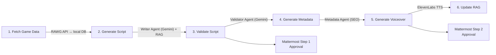
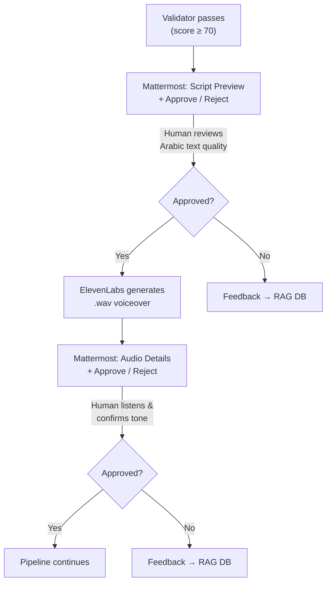

# pi_youtube_stack

Fully automated YouTube content-generation microservice for **Raspberry Pi 5**. Generates engaging Arabic gaming videos — from script writing to voiceover — powered by Google Gemini, ElevenLabs, and a RAG knowledge base.

---

## System Architecture (C4 Model)


---

## Pipeline Flow



---

## Content Types

| Type               | Trigger                    | Description                                  |
| ------------------ | -------------------------- | -------------------------------------------- |
| `monthly_releases` | 25th of every month (auto) | Top 10-15 games releasing next month         |
| `aaa_review`       | Event / manual             | Deep-dive review of a major AAA title        |
| `upcoming_games`   | Event / manual             | Curated list of upcoming titles with teasers |

> The system is **extensible** — add new content types in `config/settings.py` and matching prompt templates in `config/prompts/`.

---

## Prerequisites

All commands below assume a **fresh Raspberry Pi OS (64-bit, Bookworm)** installation. Adapt as needed for other Debian-based distros.

### 1. System packages

```bash
sudo apt-get update && sudo apt-get upgrade -y

sudo apt-get install -y \
    python3 python3-pip python3-venv \
    docker.io docker-compose \
    libpq-dev gcc \
    curl jq git
```

### 2. Docker permissions

```bash
sudo usermod -aG docker "$USER"
# Log out and back in, then verify:
docker info --format '{{.ServerVersion}}'
```

### 3. Clone the repository

```bash
git clone <repo-url> pi_youtube_stack
cd pi_youtube_stack
```

### 4. Create the Python virtualenv

```bash
python3 -m venv .venv
source .venv/bin/activate
pip install --upgrade pip
pip install -r requirements.txt
```

### 5. Configure environment variables

```bash
cp .env.example .env
nano .env          # fill in every key marked "REQUIRED"
```

Required API keys:

| Variable                | Where to get it                                                      |
| ----------------------- | -------------------------------------------------------------------- |
| `GEMINI_API_KEY`        | [Google AI Studio](https://aistudio.google.com/apikey)               |
| `ELEVENLABS_API_KEY`    | [ElevenLabs Settings](https://elevenlabs.io/app/settings/api-keys)   |
| `ELEVENLABS_VOICE_ID`   | ElevenLabs → Voices → your cloned voice → Copy ID                    |
| `RAWG_API_KEY`          | [RAWG.io API Docs](https://rawg.io/apidocs) (free, 20 K req/month)   |
| `MATTERMOST_URL`        | Self-hosted Mattermost server URL (e.g. `http://192.168.1.100:8065`) |
| `MATTERMOST_BOT_TOKEN`  | Personal Access Token for `bot-youtube`                              |
| `MATTERMOST_CHANNEL_ID` | Channel ID for `#pipeline-youtube`                                   |

### 6. Start Docker containers

```bash
docker-compose up -d

# Wait for PostgreSQL to be ready (init.sql runs automatically)
docker-compose logs -f postgres_youtube   # Ctrl-C once you see "database system is ready"
```

### 7. Create output directories

```bash
mkdir -p output/audio output/metadata output/thumbnails logs
chmod +x scripts/*.py
```

---

## How to Start the System

### Option A — Automated setup (recommended)

The included `setup.sh` performs **all** prerequisite steps above in one go:

```bash
chmod +x setup.sh
./setup.sh
```

After it finishes:

```bash
# 1. Fill in your API keys
nano .env

# 2. Open n8n in a browser
echo "http://$(hostname -I | awk '{print $1}'):5678"

# 3. Import the workflow
#    n8n UI → Workflows → Import from File → n8n_workflow/workflow.json
#    Then toggle the workflow to "Active"
```

### Option B — Manual pipeline test (without n8n)

```bash
source .venv/bin/activate

# Step 1 — Fetch game data from RAWG
python3 scripts/fetch_game_data.py --type monthly_releases

# Step 2 — Generate an Arabic script
python3 scripts/generate_script.py --type monthly_releases

# Step 3 — Validate the script (sends Mattermost Step 1 approval)
python3 scripts/validate_script.py --script-id <UUID_FROM_STEP_2>

# Step 4 — Generate YouTube metadata
python3 scripts/generate_metadata.py --script-id <UUID>

# Step 5 — Generate voiceover (sends Mattermost Step 2 approval)
python3 scripts/generate_voiceover.py --script-id <UUID>

# Step 6 — Process pending feedback into RAG
python3 scripts/update_rag.py
```

### Option C — Trigger via n8n webhook

```bash
# Monthly releases (same as auto-schedule)
curl -X POST http://localhost:5678/webhook/trigger-pipeline \
  -H "Content-Type: application/json" \
  -d '{"content_type": "monthly_releases"}'

# AAA review for a specific game
curl -X POST http://localhost:5678/webhook/trigger-content \
  -H "Content-Type: application/json" \
  -d '{"content_type": "aaa_review", "game_slug": "elden-ring"}'
```

---

## Folder Structure

```
pi_youtube_stack/
│
├── config/                          # --- Configuration ---
│   ├── __init__.py
│   ├── settings.py                  # Env var loading, content-type registry
│   └── prompts/
│       ├── __init__.py
│       ├── writer_prompts.py        # Arabic writer system prompt + 3 templates
│       ├── validator_prompts.py     # Quality review prompt (JSON output schema)
│       └── metadata_prompts.py      # YouTube SEO prompt (titles/tags/hashtags)
│
├── database/                        # --- Data Layer ---
│   ├── __init__.py
│   ├── init.sql                     # Full schema: 8 tables + pgvector + triggers
│   ├── connection.py                # ThreadedConnectionPool, context manager
│   ├── models.py                    # Pydantic v2 models for every entity
│   └── rag_manager.py              # Vector search, duplicate check, feedback store
│
├── services/                        # --- External API Wrappers ---
│   ├── __init__.py
│   ├── gemini_service.py            # generate_text / generate_json / generate_embedding
│   ├── elevenlabs_service.py        # TTS streaming → PCM → WAV conversion
│   ├── rawg_service.py              # RAWG REST client + DB UPSERT
│   ├── mattermost_service.py        # Mattermost approval messages, approve/reject buttons
│   └── embedding_service.py         # Thin convenience layer over GeminiService
│
├── agents/                          # --- AI Agent System ---
│   ├── __init__.py
│   ├── base_agent.py                # ABC with RAG helpers, duration estimator, run logger
│   ├── writer_agent.py              # Generates Arabic YouTube scripts (Gemini)
│   ├── validator_agent.py           # Scores scripts (8 criteria), threshold = 70
│   └── metadata_agent.py            # Titles, description, tags, game info cards
│
├── scripts/                         # --- CLI Entry Points (called by n8n) ---
│   ├── __init__.py
│   ├── fetch_game_data.py           # 1. RAWG → local DB
│   ├── generate_script.py           # 2. Writer Agent
│   ├── validate_script.py           # 3. Validator Agent + Mattermost Step 1
│   ├── generate_metadata.py         # 4. Metadata Agent
│   ├── generate_voiceover.py        # 5. ElevenLabs TTS + Mattermost Step 2
│   └── update_rag.py                # 6. Feedback → RAG embeddings
│
├── n8n_workflow/
│   └── workflow.json                # Importable n8n workflow definition
│
├── output/                          # Generated assets (gitignored)
│   ├── audio/                       #   └── *.wav voiceovers
│   ├── metadata/                    #   └── metadata_<uuid>.json
│   └── thumbnails/                  #   └── (future)
│
├── docker-compose.yml               # postgres_youtube + n8n_youtube containers
├── requirements.txt                 # Python dependencies
├── setup.sh                         # One-command Raspberry Pi setup
├── .env.example                     # Environment variable template
├── .gitignore                       # Ignores .env, output/, __pycache__, volumes
└── README.md                        # ← you are here
```

---

## Approval Flow (Mattermost)

The pipeline uses a **two-step human-in-the-loop** approval via Mattermost:



Rejection feedback is automatically stored in the RAG database so the Writer Agent learns from mistakes.

---

## Docker Services

| Service            | Image                    | Port | Memory Limit |
| ------------------ | ------------------------ | ---- | ------------ |
| `postgres_youtube` | `pgvector/pgvector:pg16` | 5433 | 512 MB       |
| `n8n_youtube`      | `n8nio/n8n:latest`       | 5678 | 512 MB       |

Both run on an isolated Docker bridge network `youtube_stack_net`.

```bash
# Start
docker-compose up -d

# View logs
docker-compose logs -f

# Stop
docker-compose down

# Reset DB (destroys all data)
docker-compose down -v && docker-compose up -d
```

---

## Key Design Decisions

| Decision                   | Rationale                                             |
| -------------------------- | ----------------------------------------------------- |
| **Python for all logic**   | n8n is router-only; scripts are testable and portable |
| **JSON stdout protocol**   | Every script prints JSON to stdout for n8n parsing    |
| **Logging to stderr**      | Keeps stdout clean for data exchange                  |
| **pgvector HNSW index**    | Fast approximate nearest-neighbor on Raspberry Pi     |
| **768-dim embeddings**     | Gemini `embedding-001` output dimension               |
| **130 WPM for Arabic**     | Standard Arabic narration speaking rate               |
| **Approval threshold: 70** | Configurable in `ValidatorAgent.APPROVAL_THRESHOLD`   |
| **512 MB per container**   | Respects Pi 5 memory constraints                      |

---

## Adding a New Content Type

1. **Register** in `config/settings.py` → `CONTENT_TYPES` dict:

   ```python
   "indie_spotlight": ContentTypeConfig(
       name="indie_spotlight",
       schedule_type="event",
       description="Spotlight on indie games",
   )
   ```

2. **Add prompt template** in `config/prompts/writer_prompts.py`:

   ```python
   INDIE_SPOTLIGHT_PROMPT = """..."""
   WRITER_PROMPTS["indie_spotlight"] = INDIE_SPOTLIGHT_PROMPT
   ```

3. **Trigger** via webhook:
   ```bash
   curl -X POST http://localhost:5678/webhook/trigger-content \
     -H "Content-Type: application/json" \
     -d '{"content_type": "indie_spotlight", "game_slug": "hollow-knight"}'
   ```

---

## Environment Variables

| Variable                | Default                         | Description                           |
| ----------------------- | ------------------------------- | ------------------------------------- |
| `GEMINI_API_KEY`        | —                               | Google Gemini API key                 |
| `GEMINI_MODEL`          | `gemini-2.5-pro`                | Gemini model name                     |
| `ELEVENLABS_API_KEY`    | —                               | ElevenLabs API key                    |
| `ELEVENLABS_VOICE_ID`   | —                               | Cloned voice ID                       |
| `ELEVENLABS_MODEL`      | `eleven_multilingual_v2`        | TTS model                             |
| `RAWG_API_KEY`          | —                               | RAWG.io API key                       |
| `MATTERMOST_URL`        | —                               | Self-hosted Mattermost server URL     |
| `MATTERMOST_BOT_TOKEN`  | —                               | Personal Access Token for bot-youtube |
| `MATTERMOST_CHANNEL_ID` | —                               | Channel ID for #pipeline-youtube      |
| `DB_HOST`               | `localhost`                     | PostgreSQL host                       |
| `DB_PORT`               | `5433`                          | PostgreSQL port                       |
| `DB_NAME`               | `youtube_rag`                   | Database name                         |
| `DB_USER`               | `yt_user`                       | Database user                         |
| `DB_PASSWORD`           | `yt_secure_pass_2025`           | Database password                     |
| `N8N_WEBHOOK_BASE`      | `http://localhost:5678/webhook` | n8n webhook base URL                  |

---

## Troubleshooting

| Problem                       | Solution                                                                                                                      |
| ----------------------------- | ----------------------------------------------------------------------------------------------------------------------------- |
| `psycopg2` install fails      | `sudo apt install libpq-dev gcc` then re-run pip                                                                              |
| pgvector not found            | Ensure `pgvector/pgvector:pg16` image is used (not plain `postgres`)                                                          |
| n8n can't find scripts        | Check volume mount in `docker-compose.yml` points to project root                                                             |
| Gemini rate limit             | Reduce batch sizes, add delays between calls                                                                                  |
| ElevenLabs quota              | Check usage: `python3 -c "from services.elevenlabs_service import ElevenLabsService; print(ElevenLabsService().get_usage())"` |
| Mattermost buttons don't work | Verify `N8N_WEBHOOK_BASE` is accessible from your network and Mattermost interactive message actions are configured           |
| Docker permission denied      | `sudo usermod -aG docker $USER` + re-login                                                                                    |

---

## License

Private — internal use only.
